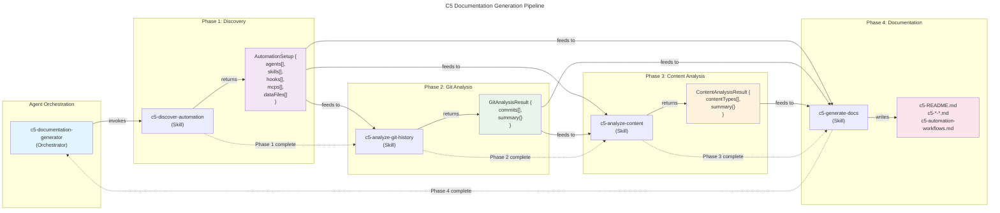

# C4 Code Level: Claude Code Automation Documentation System

## Overview

**Name**: C5 Documentation Generator - Claude Code Automation Documentation System

**Description**: A comprehensive automation documentation system that discovers, analyzes, and documents Claude Code agents, skills, hooks, and MCP servers used in a codebase. Consists of a primary orchestrator agent and four specialized skill modules that work together to generate C5 (Claude Code Usage) documentation.

**Location**: `.claude/` directory
- Agent: `.claude/agents/c5-documentation-generator.md`
- Skills: `.claude/skills/c5-*.md` (4 skill files)

**Language**: Claude Code Markdown (Multi-phase procedural workflow)

**Purpose**: Document actual automation usage patterns (what agents/skills/MCPs were used to create which content) to create an "automation recipe book" for team onboarding and workflow replication.

**Model Configuration**: Claude Opus (claude-opus-4-5-20251101) for complex multi-phase analysis

**Token Usage**: 50,000-100,000 tokens per generation (varies by project size)

---

## Code Architecture Overview

This is a **procedural/functional automation system** composed of:
- **1 Orchestrator Agent** - Coordinates 4-phase workflow
- **4 Specialized Skills** - Each handles one phase
- **Bash tools** - Git history analysis and directory operations
- **File I/O tools** - Reading/writing markdown and JSON
- **Glob/Grep tools** - File discovery and content analysis

The system follows a **pipeline pattern**: Phase 1 → Phase 2 → Phase 3 → Phase 4, with each phase's output feeding into the next.

---

## Code Elements

### Agent

#### `c5-documentation-generator`

**File**: `.claude/agents/c5-documentation-generator.md`

**Purpose**: Orchestrates 4-phase C5 documentation generation workflow. Serves as the entry point for users to generate complete automation documentation.

**Signature**: (No formal parameters - uses interactive mode and configuration)

**Key Configuration**:
- **Input**: None initially (discovers everything)
- **Output**: 5-7 markdown files in `docs/architecture/`
- **Model**: Claude Opus (claude-opus-4-5-20251101)
- **Interactive**: Yes - asks clarifying questions about output directory, git history inclusion, custom data file paths

**Workflow Phases**:
1. **Phase 1: Discovery** - Invokes `c5-discover-automation` skill
2. **Phase 2: Git Analysis** - Invokes `c5-analyze-git-history` skill
3. **Phase 3: Content Analysis** - Invokes `c5-analyze-content` skill
4. **Phase 4: Documentation** - Invokes `c5-generate-docs` skill

**Dependencies**:
- Skill: `c5-discover-automation` (Phase 1)
- Skill: `c5-analyze-git-history` (Phase 2)
- Skill: `c5-analyze-content` (Phase 3)
- Skill: `c5-generate-docs` (Phase 4)
- Bash tools for git operations
- File I/O tools for reading/writing

**Output Files**:
```
docs/architecture/
├── c5-README.md                      # Overview and navigation
├── c5-{content-type}.md              # Per-content-type workflows (1+ files)
├── c5-automation-workflows.md        # Master reference
└── README.md                         # Updated with C5 section
```

**Error Handling**:
- No `.claude/` directory → Error with setup instructions
- No agents/skills found → Warning but continues with empty arrays
- No git history → Offers option to skip Phase 2
- No data files → Notes that Phase 3 will be skipped

**Configuration Options** (Interactive):
- `outputDir`: Where to write C5 files (default: `docs/architecture/`)
- `includeGitHistory`: Whether to analyze git (default: true)
- `dataFilePaths`: Custom data file locations (default: auto-detect)

---

### Skills (4 Phases)

#### Phase 1: `c5-discover-automation`

**File**: `.claude/skills/c5-discover-automation.md`

**Purpose**: Discovers all automation setup in the `.claude/` directory

**Signature**: `discoverAutomation(): AutomationSetup`

**Parameters**: None (self-contained)

**Return Type**:
```typescript
interface AutomationSetup {
  agents: Agent[];
  skills: Skill[];
  hooks: Hook[];
  mcps: MCP[];
  dataFiles: string[];
  claudeDirectory: string;
  errors?: string[];
  warnings?: string[];
}

interface Agent {
  name: string;           // "rehearsal-blog-generator"
  file: string;           // ".claude/agents/rehearsal-blog-generator.md"
  purpose: string;        // Description from "Purpose" section
  skillsUsed: string[];   // ["engineering-deep-research", ...]
  mcpsUsed: string[];     // ["reddit-mcp", "web-search-mcp", ...]
}

interface Skill {
  name: string;           // "engineering-deep-research"
  file: string;           // ".claude/skills/engineering-deep-research.md"
  purpose: string;        // Description from "Purpose" section
}

interface Hook {
  name: string;           // "git-pull-reminder"
  file: string;           // ".claude/hookify.git-pull-reminder.local.md"
  trigger: string;        // "file changes to app/data/"
  action: string;         // "Reminds to pull before editing content"
}

interface MCP {
  name: string;           // "reddit-mcp"
  operations: string[];   // ["browse_subreddit", "search_reddit", ...]
}
```

**Implementation Steps**:
1. Find `.claude/` directory using Glob tool
2. Discover agent files: `.claude/agents/*.md`
3. Discover skill files: `.claude/skills/*.md`
4. Discover hook files: `.claude/hookify.*.md`
5. Parse `settings.local.json` for MCP configuration
6. Auto-detect data files using glob patterns:
   - `app/data/*.ts`, `src/data/*.ts`, `data/*.ts`
   - `content/*.ts`, `lib/data/*.ts`
7. Extract metadata from each file using Read tool
8. Return structured JSON object

**Key Algorithms**:
- **File Discovery**: Glob patterns for flexible file finding
- **Metadata Extraction**: Regex parsing of markdown sections (Purpose, Skills, MCPs)
- **MCP Detection**: Parse JSON config and infer operations based on MCP name patterns

**Tools Used**:
- Glob tool - Find files matching patterns
- Read tool - Read file contents
- JSON parsing - Parse settings.local.json

**Error Handling**:
- No `.claude/` directory → Error: "No .claude/ directory found"
- Missing agents/skills → Warning: "No agents or skills found"
- Missing settings.local.json → Continue with empty MCPs array
- Missing data files → Continue with empty array

**Performance**: < 10 seconds for most projects

---

#### Phase 2: `c5-analyze-git-history`

**File**: `.claude/skills/c5-analyze-git-history.md`

**Purpose**: Analyzes git commit history to find automation-related commits and map to content creation

**Signature**: `analyzeGitHistory(dataFilePaths: string[], timeRange: string): GitAnalysisResult`

**Parameters**:
- `dataFilePaths: string[]` - Data files from Phase 1 (optional filtering)
- `timeRange: string` - How far back to search (default: "3 months ago")

**Return Type**:
```typescript
interface GitAnalysisResult {
  commits: Commit[];
  summary: CommitSummary;
  warnings?: string[];
  errors?: string[];
}

interface Commit {
  hash: string;                    // Full commit hash "9744db6abc123"
  shortHash: string;               // 7-char short hash "9744db6"
  date: string;                    // YYYY-MM-DD format "2026-01-13"
  dateISO: string;                 // ISO 8601 "2026-01-13T10:30:00Z"
  message: string;                 // Commit message
  author: string;                  // Author name
  filesChanged: string[];          // ["app/data/blog-posts.ts"]
  linesAdded: number;              // 120
  linesDeleted: number;            // 5
  inferredAgent: string | null;    // "rehearsal-blog-generator" or null
  contentAdded: ContentItem[];     // [{type, slug, file}]
  automationType: string;          // "content-generation", "manual-fix", etc.
}

interface ContentItem {
  type: string;                    // "BlogPost", "IIMSchool"
  slug: string;                    // "gap-year-career-pivot-iim-interview-2026"
  file: string;                    // "app/data/blog-posts.ts"
}

interface CommitSummary {
  totalCommits: number;
  automationCommits: number;
  manualCommits: number;
  dateRange: {
    earliest: string;
    latest: string;
  };
  agentsUsed: string[];
  filesAffected: string[];
  contentTypesCreated: string[];
}
```

**Implementation Steps**:
1. Check git repository exists: `git rev-parse --git-dir`
2. Search git log for automation commits:
   ```bash
   git log --all --oneline --since="3 months ago" \
     --grep="feat:" --grep="agent" --grep="automation" \
     --format="%H|%h|%aI|%an|%s" -i
   ```
3. For each commit, extract metadata
4. Get files changed: `git show {hash} --name-only --format=""`
5. Count line changes: `git show {hash} --shortstat --format=""`
6. Infer agent from commit message (Priority):
   - Explicit mentions: "blog generator" → "rehearsal-blog-generator"
   - File-based: "blog-posts.ts" → "rehearsal-blog-generator"
   - Pattern-based: Multiple items + "feat:" → "unknown-agent"
7. Extract content slugs from diffs: `git diff {hash}^ {hash} -- {filepath}`
   - Regex: `/slug:\s*['"]([\w-]+)['"]/g`
8. Classify automation type (content-generation, manual-fix, refactor, etc.)
9. Build summary statistics
10. Return structured JSON

**Key Algorithms**:
- **Commit Parsing**: Split by delimiter, extract hash/date/message
- **Agent Inference**: Multi-level pattern matching (explicit > file-based > keyword-based)
- **Slug Extraction**: Regex matching on diff output
- **Automation Classification**: Rule-based classification (infrastructure, content-generation, content-update, manual-fix, etc.)

**Tools Used**:
- Bash tool - Execute git commands
- Text parsing - Extract metadata from git output

**Error Handling**:
- No git repo → Error: "No git repository found"
- No automation commits → Warning: "No automation-related commits found"
- Git command fails → Log error, continue with partial data
- Cannot parse commit → Skip commit, add warning

**Performance**: < 5 seconds for most projects (3 months history)

**Optimization Strategies**:
- Time range filtering: Default "3 months ago" (configurable)
- File filtering: Only analyze commits touching data files
- Parallel processing: If available, process multiple commits in parallel

---

#### Phase 3: `c5-analyze-content`

**File**: `.claude/skills/c5-analyze-content.md`

**Purpose**: Maps content items to agents/skills/MCPs that created them

**Signature**: `analyzeContent(dataFiles: string[], commits: Commit[], agents: Agent[], exampleLimit: number): ContentAnalysisResult`

**Parameters**:
- `dataFiles: string[]` - From Phase 1 Discovery
- `commits: Commit[]` - From Phase 2 Git Analysis
- `agents: Agent[]` - From Phase 1 Discovery
- `exampleLimit: number` - Max examples per content type (default: 3)

**Return Type**:
```typescript
interface ContentAnalysisResult {
  contentTypes: ContentType[];
  summary: ContentSummary;
  warnings?: string[];
}

interface ContentType {
  type: string;                                          // "BlogPost"
  displayName: string;                                   // "Blog Posts"
  file: string;                                          // "app/data/blog-posts.ts"
  count: number;                                         // 50
  agentUsed: string | null;                             // "rehearsal-blog-generator"
  confidence: 'high' | 'medium' | 'low' | 'unknown';
  skillsUsed: string[];                                 // ["engineering-deep-research"]
  mcpsUsed: string[];                                   // ["reddit-mcp", "web-search-mcp"]
  creationPattern: 'batch' | 'incremental' | 'bulk' | 'continuous' | 'unknown';
  batchInfo?: {
    avgBatchSize: number;                               // 4
    totalBatches: number;                               // 12
    frequency: 'daily' | 'weekly' | 'monthly' | 'irregular' | 'one-time';
  };
  examples: Example[];                                  // 2-5 real items
  statistics?: {
    avgWordCount?: number;
    avgReadingTime?: number;
    avgSEOScore?: number;
    categories?: string[];
    dateRange?: { earliest: string; latest: string; };
  };
}

interface Example {
  slug: string;                                          // "gap-year-career-pivot-iim-interview-2026"
  title: string;                                         // "Gap Year Career Pivot IIM Interview 2026"
  dateCreated: string;                                   // "2026-01-13"
  gitCommit: string;                                     // "9744db6"
  wordCount?: number;
  seoScore?: number;
  readingTime?: number;
  category?: string;
}

interface ContentSummary {
  totalContentTypes: number;
  totalContentItems: number;
  automatedItems: number;
  manualItems: number;
  agentsIdentified: string[];
  skillsIdentified: string[];
  mcpsIdentified: string[];
}
```

**Implementation Steps**:
1. For each data file:
   - Read file contents using Read tool
   - Parse TypeScript/JavaScript structure
2. Identify content type:
   - Try TypeScript type annotation: `const blogPosts: BlogPost[]`
   - Fallback to filename pattern: "blog-posts" → "BlogPost"
   - Count items: Regex matching for object/entry count
3. For each content type, match to git commits:
   - Find commits where `filesChanged` includes this data file
   - Extract slugs from commit's `contentAdded` array
   - Correlate by dates (within 1-2 days tolerance)
4. Infer agent/skills/MCPs:
   - Priority 1: From git commits (Phase 2 analysis)
   - Priority 2: From agent files (read `.claude/agents/*.md`)
   - Priority 3: From content patterns (batch additions → likely agent-generated)
5. Extract skills from agent file:
   - Search for `/skill {name}` patterns
   - Look for "Skills Used:" sections
6. Extract MCPs from agent file:
   - Search for MCP mentions in "MCPs Used:" sections
   - Pattern: `-` followed by `**{name}-mcp**`
7. Analyze creation patterns:
   - "batch" - 3+ items per commit, regular intervals
   - "incremental" - 1-2 items per commit, irregular
   - "bulk" - 10+ items in single commit
   - "continuous" - steady stream, regular cadence
8. Extract 2-5 example items:
   - Prefer recent commits
   - Prefer diverse dates/batches
   - Prefer complete metadata
9. Calculate statistics:
   - Average word count, reading time, SEO score
   - Unique categories
   - Date range (earliest to latest)
10. Build summary across all content types

**Key Algorithms**:
- **Type Detection**: TypeScript type annotation parsing + filename heuristics
- **Content Counting**: Regex-based slug/entry detection
- **Agent Inference**: Multi-priority system (commits > agent files > patterns)
- **Skill Extraction**: Parse agent markdown files for `/skill` mentions
- **Pattern Analysis**: Analyze commit intervals and batch sizes to classify creation pattern
- **Statistics**: Calculate averages and aggregates across items

**Tools Used**:
- Read tool - Read data files and agent files
- Regex parsing - Extract content items, types, slugs
- Array operations - Aggregate statistics

**Error Handling**:
- Cannot read data file → Skip file, add warning
- Cannot parse structure → Skip file, add warning
- No items found → Set count to 0, add info message
- Cannot infer agent → Set to null, confidence "unknown"
- Cannot extract examples → Return empty array

**Special Handling**:
- Shared data structures (multiple arrays in one file) → Count primary array only
- Legacy vs V2 files → Prefer V2/latest version
- Complex nested structures → Count top-level keys as items

**Performance**: < 10 seconds for most projects

---

#### Phase 4: `c5-generate-docs`

**File**: `.claude/skills/c5-generate-docs.md`

**Purpose**: Generates C5 markdown documentation files from data collected in Phases 1-3

**Signature**: `generateDocs(phase1Data: AutomationSetup, phase2Data: GitAnalysisResult, phase3Data: ContentAnalysisResult, outputDir: string): DocumentationResult`

**Parameters**:
- `phase1Data: AutomationSetup` - From Phase 1 Discovery
- `phase2Data: GitAnalysisResult` - From Phase 2 Git Analysis
- `phase3Data: ContentAnalysisResult` - From Phase 3 Content Analysis
- `outputDir: string` - Output directory (default: "docs/architecture/")

**Return Type**:
```typescript
interface DocumentationResult {
  filesCreated: string[];
  filesUpdated: string[];
  success: boolean;
  warnings?: string[];
  errors?: string[];
}
```

**Output Files Created**:
```
docs/architecture/
├── c5-README.md                      # Overview (7-10 KB)
├── c5-blog-posts.md                  # Content-type doc (10-15 KB)
├── c5-bschool-pages.md               # Content-type doc (10-15 KB)
├── c5-engineering-guides.md          # Content-type doc (8-12 KB)
├── c5-automation-workflows.md        # Master reference (20-30 KB)
└── README.md                         # Updated (adds C5 section)
```

**Implementation Steps**:

**Step 1: Create output directory**
```bash
mkdir -p docs/architecture
```

**Step 2: Generate C5 README**
- File: `docs/architecture/c5-README.md`
- Contents:
  - "What is C5?" explanation
  - Project automation summary ({{AUTOMATED_ITEMS}}/{{TOTAL_ITEMS}})
  - List of agents, skills, hooks, MCPs
  - Navigation links to content-type docs
  - Quick reference: Agent → Content Type mapping table
  - Automation statistics from Phase 2
  - How to use C5 guide
  - Related documentation links

**Step 3: Generate content-type documents**
- For each content type from Phase 3:
  - File: `docs/architecture/c5-{slugify(displayName)}.md`
  - Contents:
    - Overview (content type, count, agent used, data file)
    - Automation workflow details
    - Skills and MCPs used
    - Step-by-step workflow steps
    - How to create guide
    - Real examples with git commits
    - Content statistics
    - Troubleshooting section
    - Extending workflow section
    - Links to related content-type docs

**Step 4: Generate master automation workflows reference**
- File: `docs/architecture/c5-automation-workflows.md`
- Contents:
  - Quick links to sections
  - Agents section (detailed specs for each)
  - Skills section (detailed specs for each)
  - Hooks section (trigger/action pairs)
  - MCP servers section (operations list)
  - Workflow diagrams (Mermaid):
    - Agent orchestration flow
    - Content pipeline diagram
  - Configuration files section
  - Usage patterns (3 examples)
  - Best practices
  - Extending the system guide
  - Troubleshooting section

**Step 5: Update architecture README**
- Read existing `docs/architecture/README.md`
- Insert C5 section after line 42 (after "Start with Automation")
- Add:
  - "Level 5: C5 (Claude Code Usage)" section
  - Link to C5 README
  - Content-type workflow links
  - Master reference link
- Write updated file back

**Step 6: Write all files to disk**
- Use Write tool for each generated markdown file
- Track created files in array
- Handle errors: skip file, add to warnings, continue

**Template Placeholders Filled**:
From Phase 1:
- `{{AGENT_COUNT}}`, `{{AGENT_LIST}}` - Number and list of agents
- `{{SKILL_COUNT}}`, `{{SKILL_LIST_ABBREVIATED}}` - Skills (truncate if > 5)
- `{{MCP_COUNT}}`, `{{MCP_LIST}}` - MCPs
- `{{HOOK_COUNT}}`, `{{HOOK_LIST}}` - Hooks

From Phase 2:
- `{{DATE_RANGE}}` - Earliest to latest commit
- `{{TOTAL_COMMITS}}`, `{{AUTOMATION_COMMITS}}`, `{{MANUAL_COMMITS}}`
- `{{AUTOMATION_COMMIT_PERCENTAGE}}`, `{{MANUAL_COMMIT_PERCENTAGE}}` - Calculated
- `{{MOST_ACTIVE_AGENT}}`, `{{MOST_ACTIVE_AGENT_COMMITS}}` - Frequency

From Phase 3:
- `{{AUTOMATED_ITEMS}}`, `{{TOTAL_ITEMS}}`, `{{AUTOMATION_PERCENTAGE}}`
- `{{CONTENT_TYPE_LIST}}` - Bulleted list of types
- `{{CONTENT_TYPE_NAVIGATION_LINKS}}` - Links to content-type docs
- `{{AGENT_CONTENT_TABLE_ROWS}}` - Agent → content type mapping
- Per-content-type: count, average word count, SEO score, examples

Current date: `{{GENERATION_DATE}}`

**Key Functions**:

```typescript
generateContentTypeLinks(contentTypes: ContentType[]): string {
  // Generate markdown links to content-type docs
  // Pattern: "- **[Blog Posts](c5-blog-posts.md)** - 50+ items"
}

generateAgentContentTable(contentTypes: ContentType[]): string {
  // Generate markdown table: | Content Type | Agent | Command |
}

generateExamplesSection(examples: Example[]): string {
  // Format each example as markdown section with metadata
  // Includes: slug, title, date, git commit, word count, SEO score
}

generateStatisticsTable(stats: Statistics): string {
  // Format statistics as markdown table: | Metric | Value |
}

slugify(text: string): string {
  // Convert "Blog Posts" → "blog-posts"
  // Remove special chars, lowercase, replace spaces with hyphens
}

fillTemplate(template: string, placeholders: object): string {
  // Replace all {{PLACEHOLDER}} with actual values
  // Return error if any {{PLACEHOLDER}} remains
}
```

**Tools Used**:
- Bash tool - Create directory (`mkdir -p`)
- Write tool - Write markdown files
- Read tool - Read existing README for updates
- String manipulation - Fill templates, slugify names

**Validation**:
- All placeholders filled (no {{PLACEHOLDER}} in output)
- Markdown syntax valid (no unclosed code blocks, broken links)
- File paths correct (forward slashes, absolute from project root)
- Content-type filenames match convention

**Error Handling**:
- Cannot create directory → Return error, suggest manual creation
- Cannot write file → Skip file, add to warnings, continue with other files
- No architecture README → Create new README with C5 section only
- Missing data from previous phases → Replace placeholder with "N/A", add warning

**Performance**: < 5 seconds for most projects (all files)

---

## Dependencies

### Internal Dependencies (Between Code Elements)

**Agent Dependencies**:
```
c5-documentation-generator
  ├─→ c5-discover-automation (skill, Phase 1)
  ├─→ c5-analyze-git-history (skill, Phase 2)
  ├─→ c5-analyze-content (skill, Phase 3)
  └─→ c5-generate-docs (skill, Phase 4)
```

**Skill Dependencies** (Data flow):
```
Phase 1: c5-discover-automation
  ├─→ outputs: agents[], skills[], hooks[], mcps[], dataFiles[]
  └─→ consumed by: Phase 2, Phase 3, Phase 4

Phase 2: c5-analyze-git-history
  ├─→ inputs: dataFilePaths[] (from Phase 1)
  ├─→ outputs: commits[], summary{}
  └─→ consumed by: Phase 3, Phase 4

Phase 3: c5-analyze-content
  ├─→ inputs: dataFiles[] (Phase 1), commits[] (Phase 2), agents[] (Phase 1)
  ├─→ outputs: contentTypes[], summary{}
  └─→ consumed by: Phase 4

Phase 4: c5-generate-docs
  ├─→ inputs: All outputs from Phases 1-3
  ├─→ outputs: Markdown files
  └─→ consumes all previous data
```

### External Dependencies

**System Tools** (all using Bash, Read, Write, Glob):
- **Git**: `git log`, `git show`, `git diff`, `git rev-parse`
- **File System**: Directory creation, file reading/writing, pattern matching
- **Standard Library**: JSON parsing, regex, string manipulation, array operations

**Configuration Files**:
- `.claude/` directory - Root of automation setup
- `.claude/agents/*.md` - Agent definitions
- `.claude/skills/*.md` - Skill definitions
- `.claude/hookify.*.md` - Hook definitions
- `.claude/settings.local.json` - MCP server configuration
- `docs/architecture/` - Output directory

**Data Files** (auto-detected):
- `app/data/*.ts` or `src/data/*.ts` or `data/*.ts`
- Contains content arrays/maps (BlogPost, IIMSchool, EngineeringGuide, etc.)

**Project Structure Assumptions**:
- Next.js or similar framework (optional)
- TypeScript data files (or JavaScript)
- Git repository with commit history
- Markdown documentation directory

---

## Relationships and Data Flow

### Pipeline Architecture



### Data Structure Flow

```
.claude/ (Input)
├── agents/*.md ──────────────┐
├── skills/*.md ──────────────┼──► [Phase 1: Discover] ──► AutomationSetup
├── hookify.*.md ─────────────┤
├── settings.local.json ──────┘
│
├── .git/ (Git History) ───────────► [Phase 2: Git Analysis] ──► GitAnalysisResult
│                           ↓
├── agents/*.md (for inference) ────┐
│                                    ├──► [Phase 3: Content Analysis] ──► ContentAnalysisResult
├── skills/*.md (for inference) ────┤
│                                    ├──► (reads dataFiles to count/analyze content)
└── data files ──────────────────────┘
    (blog-posts.ts, iim-schools-v2.ts, etc.)

[All Phase 1-3 outputs] ────────────► [Phase 4: Doc Generation] ──► docs/architecture/
                                      (applies templates, fills placeholders)
```

### Procedural Algorithm Flow (Functional Decomposition)

Each skill follows a clear procedural pattern:

**Phase 1: Discovery** (Functional composition)
```
findClaudeDir()
  ├─ readAgentFiles()
  │  ├─ extractAgentName()
  │  ├─ extractPurpose()
  │  ├─ extractSkillsUsed()
  │  └─ extractMCPsUsed()
  ├─ readSkillFiles()
  │  ├─ extractSkillName()
  │  └─ extractPurpose()
  ├─ readHookFiles()
  │  ├─ extractHookName()
  │  ├─ extractTrigger()
  │  └─ extractAction()
  ├─ parseMCPConfig()
  │  └─ extractMCPServers()
  └─ autoDetectDataFiles()
     └─ globDataFilePatterns()
```

**Phase 2: Git Analysis** (Bash + parsing)
```
checkGitRepo()
  └─ searchGitLog()
     ├─ parseCommitMetadata()
     ├─ getFilesChanged()
     ├─ getLineChanges()
     ├─ inferAgentFromMessage()
     ├─ identifyContentAdded()
     └─ classifyAutomationType()
```

**Phase 3: Content Analysis** (Regex + correlation)
```
readDataFiles()
  └─ for each dataFile:
     ├─ identifyContentType()
     ├─ countItems()
     ├─ matchToGitCommits()
     ├─ inferAgent()
     ├─ extractSkillsFromAgent()
     ├─ extractMCPsFromAgent()
     ├─ analyzeCreationPattern()
     ├─ extractExamples()
     └─ calculateStatistics()
```

**Phase 4: Documentation** (Template + composition)
```
generateDocs()
  ├─ createOutputDir()
  ├─ generateC5README()
  │  └─ fillTemplate(template, placeholders)
  ├─ generateContentTypeDocs()
  │  ├─ for each contentType:
  │  │  └─ fillTemplate(contentTypeTemplate, placeholders)
  ├─ generateAutomationWorkflows()
  │  ├─ generateAgentsSection()
  │  ├─ generateSkillsSection()
  │  ├─ generateHooksSection()
  │  └─ generateMCPsSection()
  ├─ generateWorkflowDiagrams()
  │  └─ createMermaidDiagrams()
  ├─ updateArchitectureREADME()
  │  └─ insertC5Navigation()
  └─ writeAllFiles()
     └─ for each file: writeFile(filepath, content)
```

---

## Technology Stack

**Programming Paradigm**: Procedural/Functional (Markdown + Bash orchestration)

**Languages Used**:
- **Claude Code Markdown** - Agent and skill definitions (procedural instructions)
- **Bash** - Git operations, file system commands
- **TypeScript** - Type definitions in documentation (pseudo-code for examples)
- **JSON** - Configuration (settings.local.json)
- **Markdown** - Output documentation format
- **Regex** - Pattern matching (content extraction, parsing)
- **Mermaid** - Diagram syntax (embedded in markdown)

**Tools & Frameworks**:
- **Git** - Version control analysis
- **Claude API** - Powered by Claude Opus (claude-opus-4-5-20251101)
- **File System** - Directory and file operations
- **Markdown** - Documentation format
- **MCP Protocol** - Model Context Protocol for external integrations

**Key Libraries/Patterns Used**:
- **JSON parsing** - Parse settings.local.json and create structured outputs
- **Regex matching** - Extract metadata from files and git diffs
- **Template substitution** - Fill markdown templates with collected data
- **Array operations** - Aggregate, filter, map data across phases

---

## Configuration & Settings

**Model Configuration**:
```
Model: Claude Opus (claude-opus-4-5-20251101)
Token Budget: 50,000-100,000 tokens per run
Context Window: Used for complex multi-phase analysis
Cost Optimization: Opus chosen for sophisticated analysis needs
```

**Environment Variables** (Optional):
```
CLAUDE_WORKDIR - Project root directory
GIT_AUTHOR_NAME - For commit parsing (optional)
OUTPUT_DIR - Override default docs/architecture/ (optional)
```

**Configuration Options** (Interactive Prompts):
```
1. Output directory (default: docs/architecture/)
2. Include git history analysis (default: yes)
3. Custom data file paths (default: auto-detect)
4. Time range for git analysis (default: 3 months ago)
5. Example limit per content type (default: 3)
```

---

## Code Quality & Patterns

**Design Patterns Used**:

1. **Pipeline Pattern** - 4-phase linear workflow (Phase 1 → 2 → 3 → 4)
2. **Data-Driven Architecture** - Each phase generates structured data for next phase
3. **Template Method Pattern** - Shared template structure, filled with specific data
4. **Separation of Concerns** - Each skill handles one specific phase
5. **Composition over Inheritance** - Agent composes 4 skills
6. **Functional Decomposition** - Each phase breaks into sub-tasks

**Error Handling Strategy**:
- Graceful degradation - Skip missing components, continue with what's available
- Warnings system - Non-fatal issues reported but don't stop execution
- Error capture - Errors array returned alongside valid data
- Validation - Placeholder validation before file write

**Documentation Quality**:
- All function signatures documented
- All parameters explained with types
- All return types shown with example data
- Error conditions explicitly listed
- Performance characteristics noted

---

## Testing & Validation

**Test Cases Defined**:

**Test Case 1: Rehearsal AI Project** (Full functionality)
- Expected: 2+ agents, 8+ skills, 2 hooks, 4+ MCPs, 5+ data files
- Phase 2: 4+ automation commits found
- Phase 3: 4 content types identified, 65+ items
- Phase 4: 6 markdown files created

**Test Case 2: Minimal Project** (Single agent)
- Expected: 1 agent, 0-2 skills, 0 hooks, 1+ MCPs
- Phase 2: Few or no commits
- Phase 3: 1 content type
- Phase 4: 2-3 markdown files created

**Test Case 3: No Git History** (Fresh project)
- Expected: Phase 2 gracefully skipped or error handled
- Phase 3: Cannot match content to commits
- Phase 4: Generates docs with "unknown" agent

**Test Case 4: No .claude/ Directory** (Not using automation)
- Expected: Agent terminates with error
- Suggestion: User sets up Claude Code first

---

## Limitations & Future Work

**Current Limitations**:
1. Cannot detect automation without git history
2. Cannot identify content created before git history starts
3. Requires TypeScript/JavaScript data files (not dynamic databases)
4. Agent inference limited by commit message format
5. No support for uncommitted automation work
6. Only generates markdown (no interactive HTML)

**Future Enhancements** (v2.0 ideas):
1. Interactive HTML output (searchable, filterable)
2. PDF generation for offline reference
3. Automated diagram generation
4. Database content analysis (analyze DB schemas)
5. API endpoint analysis (dynamic content)
6. GitHub Actions integration for auto-regeneration
7. Multi-repo support (monorepo analysis)
8. Pull request metadata integration
9. CI/CD run correlation
10. Content quality scoring beyond SEO

---

## Usage Examples

### Example 1: Basic Usage
```bash
/agent c5-documentation-generator
# Follows prompts, generates complete C5 docs
```

### Example 2: Custom Output Directory
```
When prompted for output directory:
→ docs/architecture/c5-docs/
```

### Example 3: Skip Git History
```
When prompted to include git analysis:
→ No (for new projects without history)
```

### Example 4: Custom Data Files
```
When prompted for data file paths:
→ src/content/blog.ts, src/content/pages.ts
```

---

## Files & Locations

**Source Files**:
- Agent: `/Users/shivakakkar/Python Projects/C5-doc-generator/claude-c5-generator/.claude/agents/c5-documentation-generator.md`
- Skill 1: `/Users/shivakakkar/Python Projects/C5-doc-generator/claude-c5-generator/.claude/skills/c5-discover-automation.md`
- Skill 2: `/Users/shivakakkar/Python Projects/C5-doc-generator/claude-c5-generator/.claude/skills/c5-analyze-git-history.md`
- Skill 3: `/Users/shivakakkar/Python Projects/C5-doc-generator/claude-c5-generator/.claude/skills/c5-analyze-content.md`
- Skill 4: `/Users/shivakakkar/Python Projects/C5-doc-generator/claude-c5-generator/.claude/skills/c5-generate-docs.md`

**Output Directory**: `docs/architecture/` (project root)

---

## Summary

This is a **sophisticated procedural automation system** that demonstrates:

1. **Complex Multi-Phase Workflows** - 4-phase pipeline with data dependencies
2. **Procedural Programming** - Clear step-by-step algorithms
3. **Functional Composition** - Pure functions combining into higher-level operations
4. **Data-Driven Design** - Each phase produces structured data for next phase
5. **Robust Error Handling** - Graceful degradation with warnings
6. **Template-Based Generation** - Parameterized markdown templates
7. **File & System Operations** - Git, directory, file I/O integration
8. **Metadata Extraction** - Regex, parsing, correlation algorithms
9. **Documentation as Code** - Self-documenting agent workflow

**Key Insight**: This system solves the "tribal knowledge" problem by automating the documentation of automation - creating an executable recipe book for how agents, skills, and MCPs were used to create content.

---

**C4 Code Documentation Generated**: January 2026
**Documentation Version**: 1.0.0
**Compatible With**: C5 Documentation Generator v1.0.0, Claude Opus 4.5
