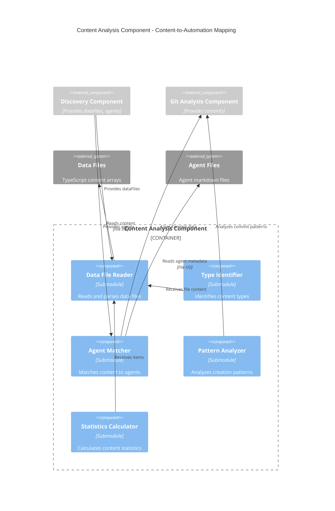

# C4 Component Level: Content Analysis Component

## Overview
- **Name**: Content Analysis Component
- **Description**: Maps content items to the agents, skills, and MCPs that created them
- **Type**: Service Component (Skill)
- **Technology**: Claude Code Markdown, Regex parsing, File I/O

## Purpose

The Content Analysis Component bridges the gap between discovered automation capabilities and actual content created. It reads data files, counts content items, correlates them with git commits to identify creation patterns, and infers which agents, skills, and MCPs were used to generate each content type.

This component provides the "automation recipe" for each content type, answering questions like "How many blog posts exist?", "Which agent created them?", "What skills and MCPs were used?", and "What was the creation pattern (batch, incremental, etc.)?"

## Software Features

- **Data File Reading**: Reads TypeScript/JavaScript data files containing content arrays
- **Content Type Identification**: Identifies content types from TypeScript annotations or filenames
- **Item Counting**: Counts the number of items in each content type
- **Git Correlation**: Correlates content items with git commits to determine creation timing
- **Agent Inference**: Infers which agent created content using multi-priority matching
- **Skills/MCPs Extraction**: Extracts skills and MCPs used from agent files
- **Creation Pattern Analysis**: Analyzes commit patterns to classify as batch, incremental, bulk, or continuous
- **Example Extraction**: Selects representative examples with full metadata
- **Statistics Calculation**: Calculates averages (word count, reading time, SEO score) and date ranges
- **Summary Aggregation**: Aggregates statistics across all content types

## Code Elements

This component contains the following code-level elements:
- [c5-analyze-content skill](./c4-code.md#phase-3-c5-analyze-content) - Phase 3 implementation

## Interfaces

### Content Analysis Interface (Public API)

**Main Operation**:
- `analyzeContent(dataFiles: string[], commits: Commit[], agents: Agent[], exampleLimit: number): ContentAnalysisResult` - Maps content to automation, returns structured analysis

**Parameters**:
```typescript
dataFiles: string[]      // From Discovery Component
commits: Commit[]        // From Git Analysis Component
agents: Agent[]          // From Discovery Component
exampleLimit: number     // Max examples per content type (default: 3)
```

**Return Type**:
```typescript
interface ContentAnalysisResult {
  contentTypes: ContentType[];
  summary: ContentSummary;
  warnings?: string[];
}

interface ContentType {
  type: string;                                          // "BlogPost"
  displayName: string;                                   // "Blog Posts"
  file: string;                                          // "app/data/blog-posts.ts"
  count: number;                                         // 50
  agentUsed: string | null;                             // "rehearsal-blog-generator"
  confidence: 'high' | 'medium' | 'low' | 'unknown';
  skillsUsed: string[];                                 // ["engineering-deep-research"]
  mcpsUsed: string[];                                   // ["reddit-mcp", "web-search-mcp"]
  creationPattern: 'batch' | 'incremental' | 'bulk' | 'continuous' | 'unknown';
  batchInfo?: {
    avgBatchSize: number;                               // 4
    totalBatches: number;                               // 12
    frequency: 'daily' | 'weekly' | 'monthly' | 'irregular' | 'one-time';
  };
  examples: Example[];                                  // 2-5 real items
  statistics?: {
    avgWordCount?: number;
    avgReadingTime?: number;
    avgSEOScore?: number;
    categories?: string[];
    dateRange?: { earliest: string; latest: string; };
  };
}

interface Example {
  slug: string;                                          // "gap-year-career-pivot-iim-interview-2026"
  title: string;                                         // "Gap Year Career Pivot IIM Interview 2026"
  dateCreated: string;                                   // "2026-01-13"
  gitCommit: string;                                     // "9744db6"
  wordCount?: number;
  seoScore?: number;
  readingTime?: number;
  category?: string;
}

interface ContentSummary {
  totalContentTypes: number;
  totalContentItems: number;
  automatedItems: number;
  manualItems: number;
  agentsIdentified: string[];
  skillsIdentified: string[];
  mcpsIdentified: string[];
}
```

### Data File Analysis Interface (Internal)

**File Reading Operations**:
- `readDataFile(filepath: string): string` - Reads data file content
- `identifyContentType(content: string, filename: string): string` - Identifies content type
- `countItems(content: string, contentType: string): number` - Counts content items
- `extractItems(content: string, contentType: string): any[]` - Extracts individual items

**Agent Inference Operations** (Multi-priority):
- `inferAgentFromGitCommits(commits: Commit[], filepath: string): string | null` - Priority 1
- `inferAgentFromAgentFiles(agents: Agent[], filepath: string): string | null` - Priority 2
- `inferAgentFromPatterns(commits: Commit[], count: number): string | null` - Priority 3

**Skills/MCPs Extraction**:
- `extractSkillsFromAgent(agentFile: string): string[]` - Parses agent file for skill mentions
- `extractMCPsFromAgent(agentFile: string): string[]` - Parses agent file for MCP mentions

**Pattern Analysis**:
- `analyzeCreationPattern(commits: Commit[], filepath: string): CreationPattern` - Analyzes commit patterns
- `calculateBatchInfo(commits: Commit[]): BatchInfo` - Calculates batch statistics
- `classifyFrequency(commits: Commit[]): Frequency` - Classifies commit frequency

**Example Selection**:
- `selectExamples(items: any[], commits: Commit[], limit: number): Example[]` - Selects representative examples

**Statistics Calculation**:
- `calculateStatistics(items: any[]): Statistics` - Calculates averages and aggregates

## Dependencies

### Components Used
- **Discovery Component**: Provides dataFiles, agents list
- **Git Analysis Component**: Provides commits array for correlation

### External Systems
- **File System**: Read access to data files and agent files
- **Read Tool**: File content reading

## Component Diagram



## Content Analysis Algorithm

```
1. Initialize Results
   - contentTypes = []
   - warnings = []

2. For Each Data File
   For each filepath in dataFiles:
   
   a) Read Data File
      - Execute: Read file content
      - If fails → Warning: "Cannot read {filepath}", skip file
   
   b) Identify Content Type
      - Priority 1: TypeScript type annotation
        - Regex: /const\s+\w+:\s*(\w+)\[\]/
        - Example: "const blogPosts: BlogPost[]" → "BlogPost"
      - Priority 2: Filename pattern
        - "blog-posts.ts" → "BlogPost"
        - "iim-schools-v2.ts" → "IIMSchool"
      - Generate displayName: "BlogPost" → "Blog Posts"
   
   c) Count Items
      - Regex patterns based on content structure:
        - Object array: /\{\s*slug:/g (count matches)
        - Map entries: /['"][\w-]+['"]\s*:\s*\{/g
      - Store count
   
   d) Filter Relevant Commits
      - commits.filter(c => c.filesChanged.includes(filepath))
      - Store as contentCommits
   
   e) Infer Agent (Multi-priority)
      - Priority 1: From Git Commits
        - Get most common inferredAgent from contentCommits
        - Confidence: "high" if > 80% agreement
      - Priority 2: From Agent Files
        - Read agent files, search for filepath mentions
        - Match agent's skillsUsed to data patterns
        - Confidence: "medium"
      - Priority 3: From Patterns
        - If 3+ items per commit → likely agent-generated
        - Confidence: "low"
      - No match → agentUsed = null, confidence = "unknown"
   
   f) Extract Skills from Agent
      - If agentUsed found:
        - Read agent markdown file
        - Regex: /skill\s+([a-z0-9-]+)/gi
        - Extract all skill names
        - Store in skillsUsed array
   
   g) Extract MCPs from Agent
      - If agentUsed found:
        - Read agent markdown file
        - Regex: /-\s+\*\*([a-z0-9-]+)-mcp\*\*/gi
        - Extract all MCP names
        - Store in mcpsUsed array
   
   h) Analyze Creation Pattern
      - Analyze contentCommits:
        - Group commits by date proximity (within 7 days)
        - Calculate avgBatchSize = total items / number of batches
        - Classify pattern:
          - "batch": 3-8 items per commit, regular intervals
          - "incremental": 1-2 items per commit, irregular
          - "bulk": 10+ items in single commit
          - "continuous": steady stream, weekly cadence
          - "unknown": insufficient data
      - Calculate batch info:
        - avgBatchSize, totalBatches
        - frequency: daily/weekly/monthly/irregular/one-time
   
   i) Extract Examples
      - Parse data file to extract 2-5 representative items
      - Prefer:
        - Recent commits (within last 3 months)
        - Diverse dates (spread across time range)
        - Complete metadata (title, slug, date)
      - For each example:
        - Extract slug, title from item
        - Match to git commit by slug
        - Extract dateCreated, gitCommit (shortHash)
        - Extract wordCount, seoScore, readingTime (if available)
        - Extract category (if available)
   
   j) Calculate Statistics
      - Parse all items from data file
      - Calculate:
        - avgWordCount (if wordCount field exists)
        - avgReadingTime (if readingTime field exists)
        - avgSEOScore (if seoScore field exists)
        - categories: unique values from category field
        - dateRange: { earliest, latest } from date fields
   
   k) Build ContentType Object
      - Aggregate all analyzed data
      - Add to contentTypes array

3. Build Summary
   - totalContentTypes = contentTypes.length
   - totalContentItems = sum of all counts
   - automatedItems = sum where agentUsed !== null
   - manualItems = totalContentItems - automatedItems
   - agentsIdentified = unique agentUsed values (excluding null)
   - skillsIdentified = unique skills across all contentTypes
   - mcpsIdentified = unique MCPs across all contentTypes

4. Return ContentAnalysisResult
   - contentTypes array
   - summary object
   - warnings array
```

## Agent Inference Strategy

The component uses a three-priority system to determine which agent created content:

**Priority 1: Git Commit Analysis** (Highest confidence)
- Look at commits touching this data file
- Use inferredAgent from commits
- Calculate confidence based on consistency:
  - 80%+ same agent → "high" confidence
  - 50-80% same agent → "medium" confidence
  - < 50% agreement → "low" confidence

**Priority 2: Agent File Analysis** (Medium confidence)
- Read agent markdown files
- Check if agent mentions this data file or content type
- Match skills/MCPs to content patterns
- Confidence: "medium"

**Priority 3: Pattern Analysis** (Low confidence)
- Analyze commit patterns (batch size, frequency)
- If batch additions (3+ items) → likely agent-generated
- Confidence: "low"

**No Agent** (Unknown)
- Cannot determine agent
- Set agentUsed = null
- Confidence: "unknown"

## Creation Pattern Classification

| Pattern | Criteria | Batch Size | Frequency | Example |
|---------|----------|-----------|-----------|---------|
| **batch** | 3-8 items per commit, regular intervals | 3-8 | weekly/monthly | 4 blog posts every 2 weeks |
| **incremental** | 1-2 items per commit, irregular | 1-2 | irregular | 1 post when needed |
| **bulk** | 10+ items in single commit | 10+ | one-time | 50 schools added at once |
| **continuous** | steady stream, regular cadence | 2-5 | daily/weekly | 3 posts every week |
| **unknown** | insufficient data or mixed patterns | varies | irregular | Cannot determine |

## Statistics Calculation

**Word Count Average**:
```typescript
avgWordCount = items.reduce((sum, item) => sum + (item.wordCount || 0), 0) / items.length
```

**Date Range**:
```typescript
dateRange = {
  earliest: items.reduce((min, item) => item.date < min ? item.date : min, items[0].date),
  latest: items.reduce((max, item) => item.date > max ? item.date : max, items[0].date)
}
```

**Categories**:
```typescript
categories = [...new Set(items.map(item => item.category).filter(Boolean))]
```

## Error Handling

**Error Conditions**:
1. **Cannot read data file** → Warning: "Cannot read {filepath}", skip file
2. **Cannot parse data structure** → Warning: "Cannot parse {filepath}", skip file
3. **No items found** → Set count to 0, add info message
4. **Cannot infer agent** → Set agentUsed = null, confidence = "unknown"
5. **Cannot extract examples** → Return empty examples array
6. **No git commits for file** → Warning: "No git history for {filepath}"

**Error Recovery**:
- Skip malformed files, continue with remaining files
- Use empty arrays for missing skills/MCPs
- Return partial data with warnings
- Always return ContentAnalysisResult structure

## Performance Characteristics

- **Runtime**: 5-10 seconds for typical projects
- **File Operations**: 2N reads (N = number of data files + N agent files)
- **Parsing Operations**: Regex-based (fast)
- **Scalability**: Linear with number of data files
- **Memory**: Holds all items in memory temporarily (typically < 10 MB)

## Output Example

```json
{
  "contentTypes": [
    {
      "type": "BlogPost",
      "displayName": "Blog Posts",
      "file": "app/data/blog-posts.ts",
      "count": 50,
      "agentUsed": "rehearsal-blog-generator",
      "confidence": "high",
      "skillsUsed": ["engineering-deep-research", "competitor-analysis"],
      "mcpsUsed": ["reddit-mcp", "web-search-mcp"],
      "creationPattern": "batch",
      "batchInfo": {
        "avgBatchSize": 4,
        "totalBatches": 12,
        "frequency": "weekly"
      },
      "examples": [
        {
          "slug": "gap-year-career-pivot-iim-interview-2026",
          "title": "Gap Year Career Pivot IIM Interview 2026",
          "dateCreated": "2026-01-13",
          "gitCommit": "9744db6",
          "wordCount": 2500,
          "seoScore": 85,
          "readingTime": 10,
          "category": "Interview Preparation"
        }
      ],
      "statistics": {
        "avgWordCount": 2300,
        "avgReadingTime": 9,
        "avgSEOScore": 82,
        "categories": ["Interview Preparation", "Career Advice"],
        "dateRange": {
          "earliest": "2025-10-15",
          "latest": "2026-01-13"
        }
      }
    }
  ],
  "summary": {
    "totalContentTypes": 4,
    "totalContentItems": 150,
    "automatedItems": 135,
    "manualItems": 15,
    "agentsIdentified": ["rehearsal-blog-generator", "interview-prep-generator"],
    "skillsIdentified": ["engineering-deep-research", "competitor-analysis"],
    "mcpsIdentified": ["reddit-mcp", "web-search-mcp"]
  },
  "warnings": ["No git history for data/legacy-posts.ts"]
}
```

## Related Components

- **[Orchestrator Component](./c4-component-orchestrator.md)** - Invokes this component in Phase 3
- **[Discovery Component](./c4-component-discovery.md)** - Provides dataFiles, agents list
- **[Git Analysis Component](./c4-component-git-analysis.md)** - Provides commits array
- **[Documentation Generation Component](./c4-component-documentation-generation.md)** - Uses content analysis for documentation

---

**Component Documentation Generated**: January 2026  
**Component Version**: 1.0.0  
**System Version**: C5 Documentation Generator v1.0.0
