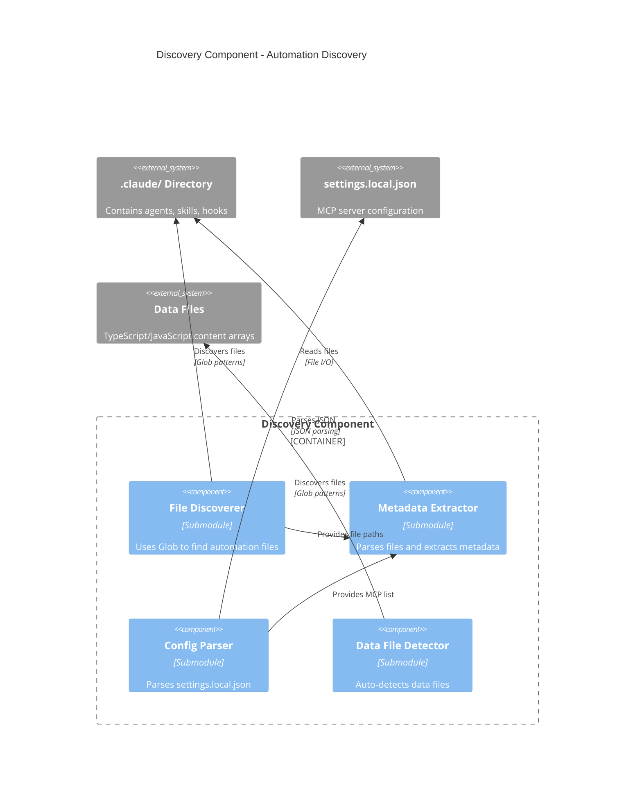

# C4 Component Level: Discovery Component

## Overview
- **Name**: Discovery Component
- **Description**: Discovers and catalogs all Claude Code automation setup in .claude/ directory
- **Type**: Service Component (Skill)
- **Technology**: Claude Code Markdown, Bash, Glob/Read tools

## Purpose

The Discovery Component is responsible for finding and extracting metadata from all Claude Code automation files in the project. It discovers agents, skills, hooks, MCP server configurations, and data files, returning a comprehensive AutomationSetup structure that describes the entire automation landscape.

This component serves as the foundation for all subsequent analysis phases by providing the inventory of automation capabilities available in the project.

## Software Features

- **Agent Discovery**: Finds and parses all agent files in `.claude/agents/`
- **Skill Discovery**: Finds and parses all skill files in `.claude/skills/`
- **Hook Discovery**: Finds and parses all hookify configuration files
- **MCP Discovery**: Parses `settings.local.json` to identify configured MCP servers
- **Data File Detection**: Auto-detects data files using glob patterns across common locations
- **Metadata Extraction**: Extracts purpose, skills used, MCPs used from each automation file
- **Validation**: Validates .claude/ directory structure and reports issues
- **Error Reporting**: Returns structured errors and warnings for missing or malformed files

## Code Elements

This component contains the following code-level elements:
- [c5-discover-automation skill](./c4-code.md#phase-1-c5-discover-automation) - Phase 1 implementation

## Interfaces

### Discovery Interface (Public API)

**Main Operation**:
- `discoverAutomation(): AutomationSetup` - Discovers all automation setup, returns structured data

**Return Type**:
```typescript
interface AutomationSetup {
  agents: Agent[];
  skills: Skill[];
  hooks: Hook[];
  mcps: MCP[];
  dataFiles: string[];
  claudeDirectory: string;
  errors?: string[];
  warnings?: string[];
}

interface Agent {
  name: string;           // "rehearsal-blog-generator"
  file: string;           // ".claude/agents/rehearsal-blog-generator.md"
  purpose: string;        // Description from "Purpose" section
  skillsUsed: string[];   // ["engineering-deep-research", ...]
  mcpsUsed: string[];     // ["reddit-mcp", "web-search-mcp", ...]
}

interface Skill {
  name: string;           // "engineering-deep-research"
  file: string;           // ".claude/skills/engineering-deep-research.md"
  purpose: string;        // Description from "Purpose" section
}

interface Hook {
  name: string;           // "git-pull-reminder"
  file: string;           // ".claude/hookify.git-pull-reminder.local.md"
  trigger: string;        // "file changes to app/data/"
  action: string;         // "Reminds to pull before editing content"
}

interface MCP {
  name: string;           // "reddit-mcp"
  operations: string[];   // ["browse_subreddit", "search_reddit", ...]
}
```

### File System Interface (Internal)

**File Discovery Operations**:
- `findClaudeDirectory(): string` - Locates .claude/ directory using Glob tool
- `discoverAgentFiles(): string[]` - Finds all `.claude/agents/*.md` files
- `discoverSkillFiles(): string[]` - Finds all `.claude/skills/*.md` files
- `discoverHookFiles(): string[]` - Finds all `.claude/hookify.*.md` files
- `findMCPConfig(): string` - Locates `.claude/settings.local.json`
- `autoDetectDataFiles(): string[]` - Finds data files using glob patterns

**Metadata Extraction Operations**:
- `extractAgentMetadata(filePath: string): Agent` - Parses agent markdown file
- `extractSkillMetadata(filePath: string): Skill` - Parses skill markdown file
- `extractHookMetadata(filePath: string): Hook` - Parses hook markdown file
- `parseMCPConfig(jsonPath: string): MCP[]` - Parses MCP configuration JSON

## Dependencies

### External Systems
- **File System**: Read access to `.claude/` directory and data files
- **Glob Tool**: Pattern-based file discovery
- **Read Tool**: File content reading
- **JSON Parser**: Parse settings.local.json

### Data File Patterns
Auto-detects data files in these locations:
- `app/data/*.ts`
- `src/data/*.ts`
- `data/*.ts`
- `content/*.ts`
- `lib/data/*.ts`

## Component Diagram



## Discovery Algorithm

```
1. Find .claude/ directory
   - Use Glob: ".claude"
   - If not found → Error: "No .claude/ directory found"
   - If found → Store claudeDirectory path

2. Discover Agent Files
   - Glob pattern: ".claude/agents/*.md"
   - For each agent file:
     - Read file content
     - Extract name from filename (remove ".md")
     - Extract purpose from "## Purpose" section (regex)
     - Extract skillsUsed from "/skill {name}" patterns (regex)
     - Extract mcpsUsed from "- **{name}-mcp**" patterns (regex)
     - Add to agents array
   - If no agents found → Warning: "No agents found"

3. Discover Skill Files
   - Glob pattern: ".claude/skills/*.md"
   - For each skill file:
     - Read file content
     - Extract name from filename (remove ".md")
     - Extract purpose from "## Purpose" section (regex)
     - Add to skills array
   - If no skills found → Warning: "No skills found"

4. Discover Hook Files
   - Glob pattern: ".claude/hookify.*.md"
   - For each hook file:
     - Read file content
     - Extract name from filename (remove "hookify." and ".local.md")
     - Extract trigger from "## Trigger" section (regex)
     - Extract action from "## Action" section (regex)
     - Add to hooks array
   - If no hooks found → Info: "No hooks configured"

5. Parse MCP Configuration
   - Read ".claude/settings.local.json"
   - If file not found → Warning: "No MCP configuration found", use empty array
   - Parse JSON
   - Extract mcpServers object
   - For each server:
     - Extract server name (key)
     - Infer operations based on server type (reddit-mcp, web-search, etc.)
     - Add to mcps array

6. Auto-Detect Data Files
   - Glob patterns: ["app/data/*.ts", "src/data/*.ts", "data/*.ts", "content/*.ts", "lib/data/*.ts"]
   - For each pattern:
     - Execute glob, collect matching files
   - Deduplicate file paths
   - Add to dataFiles array
   - If no data files found → Info: "No data files auto-detected"

7. Build AutomationSetup Object
   - Aggregate all discovered data
   - Include any errors or warnings encountered
   - Return AutomationSetup

8. Validation
   - Check if agents array is empty → Warning
   - Check if skills array is empty → Warning
   - Check if dataFiles array is empty → Info
   - Return validation results in warnings array
```

## Metadata Extraction Patterns

**Agent Purpose Extraction**:
```regex
## Purpose\s*\n\s*([^\n]+)
```

**Skill Invocation Extraction**:
```regex
/skill\s+([a-z0-9-]+)
```

**MCP Usage Extraction**:
```regex
-\s+\*\*([a-z0-9-]+)-mcp\*\*
```

**Hook Trigger Extraction**:
```regex
## Trigger\s*\n\s*([^\n]+)
```

## Error Handling

**Error Conditions**:
1. **No .claude/ directory** → Error: "No .claude/ directory found. Please set up Claude Code first."
2. **Cannot read agent file** → Warning: "Cannot read agent: {filename}", skip file
3. **Cannot parse metadata** → Warning: "Cannot parse metadata from {filename}", use defaults
4. **Missing settings.local.json** → Warning: "No MCP configuration found", continue with empty MCPs
5. **No data files found** → Info: "No data files auto-detected. Phase 3 may be limited."

**Error Recovery**:
- Skip malformed files, continue discovery
- Use empty arrays for missing categories
- Report all issues in warnings/errors arrays
- Always return AutomationSetup structure (even if empty)

## Performance Characteristics

- **Runtime**: 5-10 seconds for typical projects
- **File Operations**: 10-50 file reads (depends on agent/skill count)
- **Glob Operations**: 8 glob patterns (1 for .claude/, 3 for automation files, 5 for data files)
- **Memory**: Minimal (all data stored in arrays)
- **Scalability**: Linear with number of automation files

## Output Example

```json
{
  "agents": [
    {
      "name": "rehearsal-blog-generator",
      "file": ".claude/agents/rehearsal-blog-generator.md",
      "purpose": "Generate comprehensive blog posts about interview preparation",
      "skillsUsed": ["engineering-deep-research", "competitor-analysis"],
      "mcpsUsed": ["reddit-mcp", "web-search-mcp"]
    }
  ],
  "skills": [
    {
      "name": "engineering-deep-research",
      "file": ".claude/skills/engineering-deep-research.md",
      "purpose": "Deep research into engineering topics using web and Reddit"
    }
  ],
  "hooks": [
    {
      "name": "git-pull-reminder",
      "file": ".claude/hookify.git-pull-reminder.local.md",
      "trigger": "file changes to app/data/",
      "action": "Reminds to pull before editing content"
    }
  ],
  "mcps": [
    {
      "name": "reddit-mcp",
      "operations": ["browse_subreddit", "search_reddit", "get_post_details"]
    }
  ],
  "dataFiles": [
    "app/data/blog-posts.ts",
    "app/data/iim-schools-v2.ts"
  ],
  "claudeDirectory": ".claude",
  "warnings": [
    "No hooks configured"
  ]
}
```

## Related Components

- **[Orchestrator Component](./c4-component-orchestrator.md)** - Invokes this component in Phase 1
- **[Git Analysis Component](./c4-component-git-analysis.md)** - Uses dataFiles array for filtering
- **[Content Analysis Component](./c4-component-content-analysis.md)** - Uses agents, skills, dataFiles
- **[Documentation Generation Component](./c4-component-documentation-generation.md)** - Uses all discovered data

---

**Component Documentation Generated**: January 2026  
**Component Version**: 1.0.0  
**System Version**: C5 Documentation Generator v1.0.0
