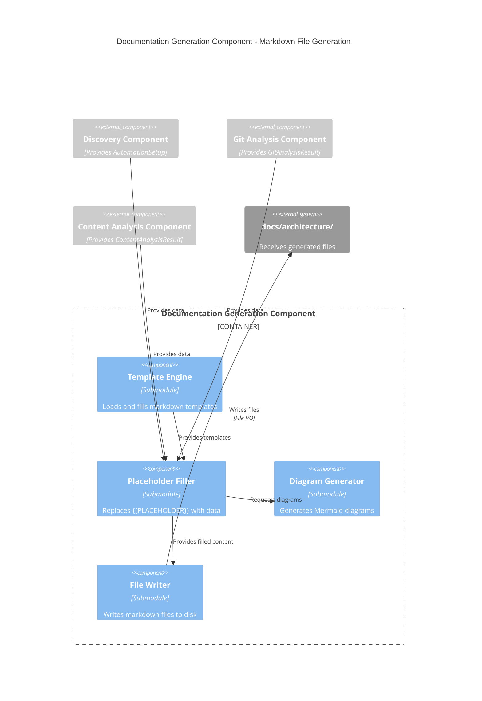
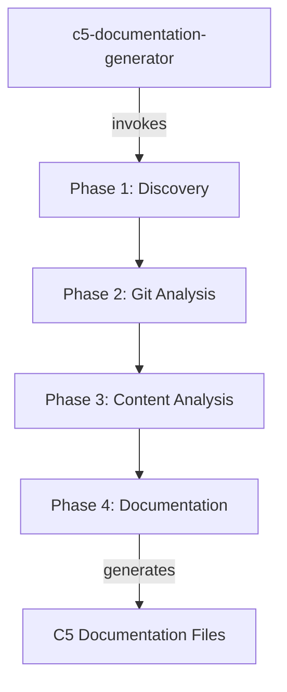
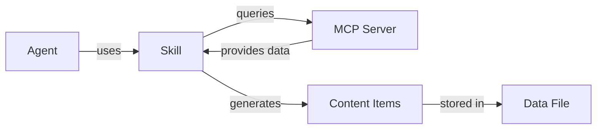

# C4 Component Level: Documentation Generation Component

## Overview
- **Name**: Documentation Generation Component
- **Description**: Generates comprehensive markdown documentation files from data collected in Phases 1-3
- **Type**: Service Component (Skill)
- **Technology**: Claude Code Markdown, Template Substitution, File I/O

## Purpose

The Documentation Generation Component is the final phase of the C5 pipeline, responsible for transforming all collected data into human-readable markdown documentation. It applies templates, fills placeholders with actual data, generates Mermaid diagrams, and writes 5-7 documentation files that serve as the "automation recipe book" for the project.

This component ensures consistent documentation format, validates completeness, and provides navigation structure across all generated files.

## Software Features

- **C5 README Generation**: Creates overview document with navigation links
- **Content-Type Documentation**: Generates individual docs for each content type with workflow details
- **Master Workflows Reference**: Creates comprehensive reference with all agents, skills, hooks, MCPs
- **Architecture README Update**: Updates existing architecture README with C5 navigation section
- **Template Application**: Fills parameterized markdown templates with collected data
- **Mermaid Diagram Generation**: Creates workflow and component diagrams
- **Placeholder Validation**: Ensures all {{PLACEHOLDER}} tags are replaced before writing
- **File Writing**: Writes all markdown files to disk with error handling
- **Navigation Generation**: Creates cross-linking between documentation files

## Code Elements

This component contains the following code-level elements:
- [c5-generate-docs skill](./c4-code.md#phase-4-c5-generate-docs) - Phase 4 implementation

## Interfaces

### Documentation Generation Interface (Public API)

**Main Operation**:
- `generateDocs(phase1Data: AutomationSetup, phase2Data: GitAnalysisResult, phase3Data: ContentAnalysisResult, outputDir: string): DocumentationResult` - Generates all documentation files

**Parameters**:
```typescript
phase1Data: AutomationSetup          // From Discovery Component
phase2Data: GitAnalysisResult        // From Git Analysis Component
phase3Data: ContentAnalysisResult    // From Content Analysis Component
outputDir: string                    // Output directory (default: "docs/architecture/")
```

**Return Type**:
```typescript
interface DocumentationResult {
  filesCreated: string[];    // Absolute paths to created files
  filesUpdated: string[];    // Absolute paths to updated files
  success: boolean;          // Overall success status
  warnings?: string[];       // Non-fatal issues
  errors?: string[];         // Fatal issues
}
```

### Template System Interface (Internal)

**Template Operations**:
- `loadTemplate(templateName: string): string` - Loads markdown template from internal definitions
- `fillTemplate(template: string, placeholders: object): string` - Replaces {{PLACEHOLDER}} with values
- `validateTemplate(content: string): boolean` - Checks if all placeholders were filled
- `generateContentTypeLinks(contentTypes: ContentType[]): string` - Generates navigation links
- `generateAgentContentTable(contentTypes: ContentType[]): string` - Generates agent mapping table
- `generateExamplesSection(examples: Example[]): string` - Formats examples as markdown
- `generateStatisticsTable(stats: Statistics): string` - Formats statistics as table
- `slugify(text: string): string` - Converts "Blog Posts" → "blog-posts"

**Diagram Generation**:
- `generateWorkflowDiagram(agents: Agent[], skills: Skill[]): string` - Creates Mermaid diagram
- `generatePipelineDiagram(): string` - Creates 4-phase pipeline diagram

### File System Interface (Internal)

**File Operations**:
- `createOutputDirectory(path: string): boolean` - Creates output directory if needed
- `writeMarkdownFile(filepath: string, content: string): boolean` - Writes markdown to disk
- `readExistingREADME(filepath: string): string` - Reads existing architecture README
- `updateREADME(content: string, c5Section: string): string` - Inserts C5 navigation section
- `getAbsolutePath(relativePath: string): string` - Converts relative to absolute path

## Dependencies

### Components Used
- **Discovery Component**: Provides AutomationSetup data
- **Git Analysis Component**: Provides GitAnalysisResult data
- **Content Analysis Component**: Provides ContentAnalysisResult data

### External Systems
- **File System**: Write access to output directory
- **Bash**: Directory creation (`mkdir -p`)
- **Write Tool**: File writing
- **Read Tool**: Read existing README for updates

## Component Diagram



## Documentation Generation Algorithm

```
1. Prepare Output Directory
   - Execute: mkdir -p {outputDir}
   - Validate directory is writable
   - If fails → Error: "Cannot create output directory", abort

2. Collect Placeholder Data
   - Aggregate data from all phases
   - Calculate derived values:
     - AUTOMATION_PERCENTAGE = (automatedItems / totalItems) * 100
     - MOST_ACTIVE_AGENT = agent with most commits
     - AGENT_CONTENT_TABLE_ROWS = map agents to content types
     - GENERATION_DATE = current date (YYYY-MM-DD)

3. Generate C5 README
   - Load C5 README template
   - Fill placeholders:
     From Phase 1:
     - {{AGENT_COUNT}}, {{AGENT_LIST}}
     - {{SKILL_COUNT}}, {{SKILL_LIST_ABBREVIATED}}
     - {{MCP_COUNT}}, {{MCP_LIST}}
     - {{HOOK_COUNT}}, {{HOOK_LIST}}
     From Phase 2:
     - {{DATE_RANGE}}, {{TOTAL_COMMITS}}
     - {{AUTOMATION_COMMITS}}, {{AUTOMATION_COMMIT_PERCENTAGE}}
     - {{MANUAL_COMMITS}}, {{MANUAL_COMMIT_PERCENTAGE}}
     - {{MOST_ACTIVE_AGENT}}, {{MOST_ACTIVE_AGENT_COMMITS}}
     From Phase 3:
     - {{AUTOMATED_ITEMS}}, {{TOTAL_ITEMS}}, {{AUTOMATION_PERCENTAGE}}
     - {{CONTENT_TYPE_LIST}}, {{CONTENT_TYPE_NAVIGATION_LINKS}}
     - {{AGENT_CONTENT_TABLE_ROWS}}
     Current:
     - {{GENERATION_DATE}}
   - Validate: Check no {{PLACEHOLDER}} remains
   - Write to: {outputDir}/c5-README.md

4. Generate Content-Type Documents
   For each contentType in phase3Data.contentTypes:
   
   a) Load Content-Type Template
   b) Slugify displayName: "Blog Posts" → "blog-posts"
   c) Fill placeholders:
      - {{CONTENT_TYPE}}, {{CONTENT_TYPE_DISPLAY}}
      - {{COUNT}}, {{DATA_FILE}}
      - {{AGENT_USED}}, {{CONFIDENCE}}
      - {{SKILLS_USED_LIST}}, {{MCPS_USED_LIST}}
      - {{CREATION_PATTERN}}, {{BATCH_INFO}}
      - {{EXAMPLES_SECTION}} (formatted examples)
      - {{STATISTICS_TABLE}} (formatted statistics)
      - {{WORKFLOW_STEPS}} (step-by-step guide)
   d) Validate: Check no {{PLACEHOLDER}} remains
   e) Write to: {outputDir}/c5-{slug}.md

5. Generate Automation Workflows Reference
   - Load Automation Workflows template
   - Generate sections:
     a) Agents section (for each agent):
        - Name, purpose, file
        - Skills used, MCPs used
        - Example usage
     b) Skills section (for each skill):
        - Name, purpose, file
        - Used by which agents
     c) Hooks section (for each hook):
        - Name, trigger, action, file
     d) MCP servers section (for each MCP):
        - Name, operations list
     e) Workflow diagrams:
        - Agent orchestration flow (Mermaid)
        - Content pipeline diagram (Mermaid)
   - Fill all placeholders
   - Validate completeness
   - Write to: {outputDir}/c5-automation-workflows.md

6. Update Architecture README
   - Read existing: {outputDir}/README.md
   - If not exists → Create new with C5 section only
   - Locate insertion point: After "Start with Automation" section (line ~42)
   - Generate C5 navigation section:
     - "Level 5: C5 (Claude Code Usage)" header
     - Link to C5 README
     - Links to content-type docs
     - Link to master workflows reference
   - Insert section at correct location
   - Write updated content back to: {outputDir}/README.md

7. Track Created Files
   - Build filesCreated array with absolute paths
   - Build filesUpdated array (README.md if updated)
   - Note any warnings or errors

8. Return DocumentationResult
   - filesCreated: [absolute paths]
   - filesUpdated: [absolute paths]
   - success: true if all files written
   - warnings: any non-fatal issues
   - errors: any fatal issues
```

## Template Placeholders

### Global Placeholders (Used Across Multiple Files)

**From Phase 1 (Discovery)**:
- `{{AGENT_COUNT}}` - Number of agents
- `{{AGENT_LIST}}` - Comma-separated list of agent names
- `{{SKILL_COUNT}}` - Number of skills
- `{{SKILL_LIST_ABBREVIATED}}` - First 5 skills (truncated if > 5)
- `{{MCP_COUNT}}` - Number of MCP servers
- `{{MCP_LIST}}` - Comma-separated list of MCP names
- `{{HOOK_COUNT}}` - Number of hooks
- `{{HOOK_LIST}}` - Comma-separated list of hook names

**From Phase 2 (Git Analysis)**:
- `{{DATE_RANGE}}` - "YYYY-MM-DD to YYYY-MM-DD"
- `{{TOTAL_COMMITS}}` - Total commits analyzed
- `{{AUTOMATION_COMMITS}}` - Commits with agent inference
- `{{AUTOMATION_COMMIT_PERCENTAGE}}` - Calculated percentage
- `{{MANUAL_COMMITS}}` - Commits without agent
- `{{MANUAL_COMMIT_PERCENTAGE}}` - Calculated percentage
- `{{MOST_ACTIVE_AGENT}}` - Agent with most commits
- `{{MOST_ACTIVE_AGENT_COMMITS}}` - Commit count for that agent

**From Phase 3 (Content Analysis)**:
- `{{AUTOMATED_ITEMS}}` - Count of automated content items
- `{{TOTAL_ITEMS}}` - Total content items
- `{{AUTOMATION_PERCENTAGE}}` - Calculated percentage
- `{{CONTENT_TYPE_LIST}}` - Bulleted list of content types
- `{{CONTENT_TYPE_NAVIGATION_LINKS}}` - Markdown links to content-type docs
- `{{AGENT_CONTENT_TABLE_ROWS}}` - Table rows mapping agents to content

**Current System**:
- `{{GENERATION_DATE}}` - Current date in YYYY-MM-DD format

### Content-Type Specific Placeholders

- `{{CONTENT_TYPE}}` - Type name (e.g., "BlogPost")
- `{{CONTENT_TYPE_DISPLAY}}` - Display name (e.g., "Blog Posts")
- `{{COUNT}}` - Number of items
- `{{DATA_FILE}}` - Relative path to data file
- `{{AGENT_USED}}` - Agent name or "unknown"
- `{{CONFIDENCE}}` - Confidence level (high/medium/low/unknown)
- `{{SKILLS_USED_LIST}}` - Bulleted list of skills
- `{{MCPS_USED_LIST}}` - Bulleted list of MCPs
- `{{CREATION_PATTERN}}` - Pattern name (batch/incremental/bulk/continuous)
- `{{BATCH_INFO}}` - Formatted batch statistics
- `{{EXAMPLES_SECTION}}` - Formatted examples with metadata
- `{{STATISTICS_TABLE}}` - Markdown table with statistics
- `{{WORKFLOW_STEPS}}` - Step-by-step workflow guide

## Helper Functions

**slugify(text: string): string**
```typescript
// Converts "Blog Posts" → "blog-posts"
// Removes special characters, lowercase, replace spaces with hyphens
return text
  .toLowerCase()
  .replace(/[^a-z0-9\s-]/g, '')
  .replace(/\s+/g, '-')
  .replace(/-+/g, '-');
```

**generateContentTypeLinks(contentTypes: ContentType[]): string**
```typescript
// Pattern: "- **[Blog Posts](c5-blog-posts.md)** - 50+ items"
return contentTypes
  .map(ct => `- **[${ct.displayName}](c5-${slugify(ct.displayName)}.md)** - ${ct.count}+ items`)
  .join('\n');
```

**generateAgentContentTable(contentTypes: ContentType[]): string**
```typescript
// Generates markdown table: | Content Type | Agent | Command |
const rows = contentTypes.map(ct => 
  `| ${ct.displayName} | ${ct.agentUsed || 'Unknown'} | \`/agent ${ct.agentUsed}\` |`
);
return `| Content Type | Agent | Command |\n|---|---|---|\n${rows.join('\n')}`;
```

**generateExamplesSection(examples: Example[]): string**
```typescript
// Format each example as markdown section with metadata
return examples.map(ex => `
### ${ex.title}
- **Slug**: ${ex.slug}
- **Date Created**: ${ex.dateCreated}
- **Git Commit**: ${ex.gitCommit}
- **Word Count**: ${ex.wordCount || 'N/A'}
- **SEO Score**: ${ex.seoScore || 'N/A'}
`).join('\n');
```

## File Outputs

**Generated Files** (5-7 files total):

1. **c5-README.md** (7-10 KB)
   - Overview of C5 system
   - Project automation summary
   - Navigation to all docs

2. **c5-{content-type}.md** (10-15 KB each, 1+ files)
   - Content-type specific workflow
   - Agent, skills, MCPs used
   - Examples and statistics

3. **c5-automation-workflows.md** (20-30 KB)
   - Master reference for all automation
   - Agent/skill/hook/MCP specs
   - Workflow diagrams

4. **README.md** (updated)
   - Existing file updated with C5 section
   - Navigation links added

## Validation

**Pre-Write Validation**:
- Check all {{PLACEHOLDER}} are replaced
- Validate Mermaid diagram syntax
- Ensure markdown links are well-formed
- Verify file paths use forward slashes

**Post-Write Validation**:
- Confirm file was written successfully
- Check file size > 0
- Verify file is readable

## Error Handling

**Error Conditions**:
1. **Cannot create directory** → Error: "Cannot create {outputDir}", abort
2. **Cannot write file** → Warning: "Cannot write {filename}", continue with other files
3. **No architecture README** → Create new README with C5 section only
4. **Missing data from phases** → Replace placeholder with "N/A", add warning
5. **Placeholder not filled** → Error: "Template incomplete: {placeholder}", don't write file

**Error Recovery**:
- Skip failed files, continue with remaining files
- Create minimal README if original doesn't exist
- Use "N/A" or "Unknown" for missing data
- Report all issues in warnings/errors arrays

## Performance Characteristics

- **Runtime**: 5-10 seconds for typical projects
- **File Operations**: 5-7 writes (depends on content type count)
- **Template Operations**: Fast (string replacement)
- **Memory**: Minimal (streaming to disk)
- **Disk Space**: 50-100 KB total for all files

## Output File Sizes

| File | Typical Size | Content |
|------|-------------|---------|
| c5-README.md | 7-10 KB | Overview, navigation, summary |
| c5-{content-type}.md | 10-15 KB each | Workflow, examples, statistics |
| c5-automation-workflows.md | 20-30 KB | Complete reference |
| README.md (updated) | +2-3 KB | C5 navigation section added |

## Diagram Examples

**Agent Orchestration Diagram**:


**Content Pipeline Diagram**:


## Related Components

- **[Orchestrator Component](./c4-component-orchestrator.md)** - Invokes this component in Phase 4
- **[Discovery Component](./c4-component-discovery.md)** - Provides AutomationSetup data
- **[Git Analysis Component](./c4-component-git-analysis.md)** - Provides GitAnalysisResult data
- **[Content Analysis Component](./c4-component-content-analysis.md)** - Provides ContentAnalysisResult data

---

**Component Documentation Generated**: January 2026  
**Component Version**: 1.0.0  
**System Version**: C5 Documentation Generator v1.0.0
