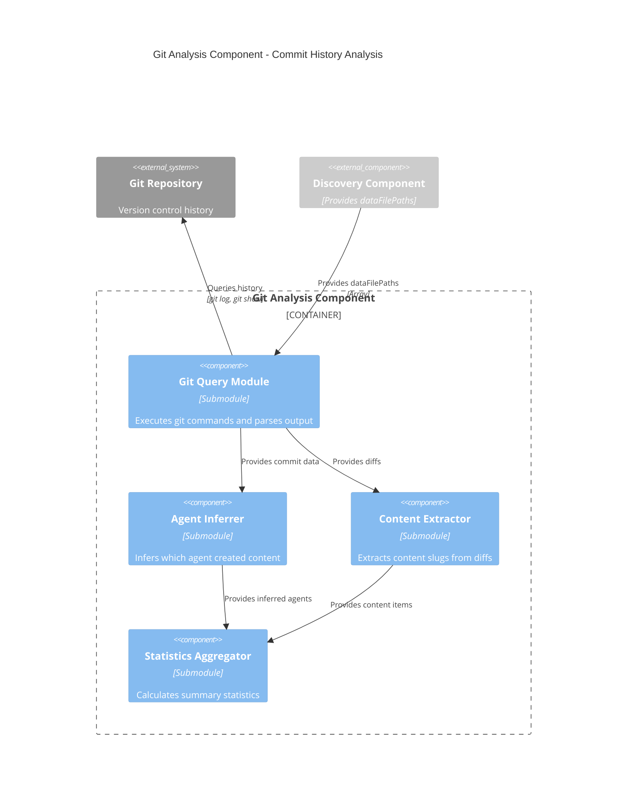

# C4 Component Level: Git Analysis Component

## Overview
- **Name**: Git Analysis Component
- **Description**: Analyzes git commit history to identify automation-related commits and content creation patterns
- **Type**: Service Component (Skill)
- **Technology**: Claude Code Markdown, Bash (git commands), Regex parsing

## Purpose

The Git Analysis Component examines the project's git commit history to identify which commits were related to automation activities, particularly content generation. It extracts commit metadata, infers which agents were used, identifies what content was added, and classifies the type of automation performed.

This component provides the temporal and historical context that links automation tools to actual content creation, enabling accurate documentation of "what was created when and by which agent."

## Software Features

- **Commit Discovery**: Searches git history for automation-related commits using keyword filters
- **Metadata Extraction**: Extracts commit hash, date, author, message from git log
- **File Change Analysis**: Identifies which files were modified in each commit
- **Line Change Tracking**: Counts lines added/deleted per commit
- **Agent Inference**: Infers which agent was used based on commit message and files changed
- **Content Slug Extraction**: Extracts content item slugs from git diffs
- **Automation Classification**: Classifies commits by automation type (content-generation, manual-fix, refactor, etc.)
- **Summary Statistics**: Calculates aggregate statistics (total commits, agents used, date range)
- **Time Range Filtering**: Limits analysis to recent history (default: 3 months)

## Code Elements

This component contains the following code-level elements:
- [c5-analyze-git-history skill](./c4-code.md#phase-2-c5-analyze-git-history) - Phase 2 implementation

## Interfaces

### Git Analysis Interface (Public API)

**Main Operation**:
- `analyzeGitHistory(dataFilePaths: string[], timeRange: string): GitAnalysisResult` - Analyzes git history and returns structured commit data

**Parameters**:
```typescript
dataFilePaths: string[]  // From Discovery Component (optional filtering)
timeRange: string        // How far back to search (default: "3 months ago")
```

**Return Type**:
```typescript
interface GitAnalysisResult {
  commits: Commit[];
  summary: CommitSummary;
  warnings?: string[];
  errors?: string[];
}

interface Commit {
  hash: string;                    // Full commit hash "9744db6abc123"
  shortHash: string;               // 7-char short hash "9744db6"
  date: string;                    // YYYY-MM-DD format "2026-01-13"
  dateISO: string;                 // ISO 8601 "2026-01-13T10:30:00Z"
  message: string;                 // Commit message
  author: string;                  // Author name
  filesChanged: string[];          // ["app/data/blog-posts.ts"]
  linesAdded: number;              // 120
  linesDeleted: number;            // 5
  inferredAgent: string | null;    // "rehearsal-blog-generator" or null
  contentAdded: ContentItem[];     // [{type, slug, file}]
  automationType: string;          // "content-generation", "manual-fix", etc.
}

interface ContentItem {
  type: string;                    // "BlogPost", "IIMSchool"
  slug: string;                    // "gap-year-career-pivot-iim-interview-2026"
  file: string;                    // "app/data/blog-posts.ts"
}

interface CommitSummary {
  totalCommits: number;
  automationCommits: number;
  manualCommits: number;
  dateRange: {
    earliest: string;
    latest: string;
  };
  agentsUsed: string[];
  filesAffected: string[];
  contentTypesCreated: string[];
}
```

### Git System Interface (Internal)

**Git Command Operations**:
- `checkGitRepository(): boolean` - Validates git repository exists
- `searchGitLog(timeRange: string): string[]` - Searches git log for automation commits
- `getCommitMetadata(hash: string): CommitMetadata` - Extracts metadata for specific commit
- `getFilesChanged(hash: string): string[]` - Gets list of files modified in commit
- `getLineChanges(hash: string): {added: number, deleted: number}` - Counts line changes
- `getCommitDiff(hash: string, filepath: string): string` - Gets diff for specific file

**Agent Inference Operations**:
- `inferAgentFromMessage(message: string): string | null` - Infers agent from commit message
- `inferAgentFromFiles(files: string[]): string | null` - Infers agent from changed files
- `inferAgentFromPattern(commit: Commit): string | null` - Infers agent from commit patterns

**Content Extraction Operations**:
- `extractContentSlugs(diff: string, filepath: string): ContentItem[]` - Extracts slugs from diff
- `identifyContentType(filepath: string): string` - Identifies content type from filename
- `classifyAutomationType(commit: Commit): string` - Classifies automation type

## Dependencies

### External Systems
- **Git Version Control**: Requires git repository with commit history
- **Bash**: Executes git commands
- **Discovery Component**: Provides dataFilePaths for filtering (optional)

### Git Commands Used
```bash
# Check if git repository exists
git rev-parse --git-dir

# Search git log for automation commits
git log --all --oneline --since="3 months ago" \
  --grep="feat:" --grep="agent" --grep="automation" \
  --format="%H|%h|%aI|%an|%s" -i

# Get files changed in commit
git show {hash} --name-only --format=""

# Count line changes
git show {hash} --shortstat --format=""

# Get diff for specific file
git diff {hash}^ {hash} -- {filepath}
```

## Component Diagram



## Git Analysis Algorithm

```
1. Validate Git Repository
   - Execute: git rev-parse --git-dir
   - If fails → Error: "No git repository found"
   - If succeeds → Continue

2. Search Git Log for Automation Commits
   - Build git log command:
     - Time filter: --since="{timeRange}" (e.g., "3 months ago")
     - Keyword filters: --grep="feat:" --grep="agent" --grep="automation" -i
     - Format: %H|%h|%aI|%an|%s (hash|short|date|author|message)
   - Execute git log command
   - Parse output into array of commit metadata

3. Process Each Commit
   For each commit:
   
   a) Extract Basic Metadata
      - hash, shortHash, date, dateISO, author, message from git log output
   
   b) Get Files Changed
      - Execute: git show {hash} --name-only --format=""
      - Parse output into filesChanged array
   
   c) Get Line Changes
      - Execute: git show {hash} --shortstat --format=""
      - Parse output: "X files changed, Y insertions(+), Z deletions(-)"
      - Extract linesAdded, linesDeleted
   
   d) Infer Agent (Multi-level priority)
      - Priority 1: Explicit mention in commit message
        - Regex: /(blog|content|interview|competitor)[\s-]*(generator|agent)/i
        - Match to known agent names
      - Priority 2: File-based inference
        - If "blog-posts.ts" changed → "rehearsal-blog-generator"
        - If "iim-schools-v2.ts" changed → "interview-prep-generator"
      - Priority 3: Pattern-based inference
        - Multiple items added (lines > 50) + "feat:" → "unknown-agent"
        - Manual edits (lines < 10) → null
   
   e) Extract Content Added
      - For each file in filesChanged:
        - If file in dataFilePaths:
          - Execute: git diff {hash}^ {hash} -- {file}
          - Extract slugs using regex: /slug:\s*['"]([\\w-]+)['"]/g
          - Identify content type from filename
          - Build ContentItem objects
   
   f) Classify Automation Type
      - "content-generation" - Multiple items added, agent inferred
      - "content-update" - Existing items modified, agent inferred
      - "manual-fix" - Small changes, no agent inferred
      - "refactor" - Large changes to structure, no new content
      - "infrastructure" - Changes to .claude/ or config files
   
   g) Add Commit to Results Array

4. Build Summary Statistics
   - totalCommits = commits.length
   - automationCommits = commits where inferredAgent !== null
   - manualCommits = totalCommits - automationCommits
   - dateRange = { earliest: min(dates), latest: max(dates) }
   - agentsUsed = unique inferredAgent values (excluding null)
   - filesAffected = unique filesChanged across all commits
   - contentTypesCreated = unique contentAdded.type values

5. Return GitAnalysisResult
   - commits array with all processed commits
   - summary object with statistics
   - warnings array (if any commits skipped or parsing failed)
   - errors array (if any git commands failed)
```

## Agent Inference Strategy

The component uses a multi-level priority system to infer which agent created content:

**Priority 1: Explicit Mention** (Highest confidence)
- Commit message contains agent name
- Pattern: "feat(blog-generator): Add 4 new blog posts"
- Confidence: High

**Priority 2: File-Based Inference** (Medium confidence)
- Changed files map to known content types
- Pattern: "blog-posts.ts" → "rehearsal-blog-generator"
- Confidence: Medium

**Priority 3: Pattern-Based Inference** (Low confidence)
- Multiple items + automation keywords
- Pattern: 100+ lines added + "feat:" → "unknown-agent"
- Confidence: Low

**No Agent** (Manual work)
- Small changes, no automation keywords
- Pattern: < 10 lines changed, no "feat:"
- Confidence: N/A (manual)

## Content Slug Extraction

**Regex Pattern**:
```regex
slug:\s*['"]([\\w-]+)['"]
```

**Example Diff**:
```typescript
+ {
+   slug: 'gap-year-career-pivot-iim-interview-2026',
+   title: 'Gap Year Career Pivot IIM Interview 2026',
+ }
```

**Extracted**:
```javascript
{
  type: "BlogPost",
  slug: "gap-year-career-pivot-iim-interview-2026",
  file: "app/data/blog-posts.ts"
}
```

## Automation Type Classification

| Type | Criteria | Example |
|------|----------|---------|
| **content-generation** | Agent inferred + new items added | "feat: Add 4 blog posts" |
| **content-update** | Agent inferred + existing items modified | "feat: Update SEO scores" |
| **manual-fix** | No agent + small changes | "fix: Typo in blog post" |
| **refactor** | Large changes + no new content | "refactor: Restructure data files" |
| **infrastructure** | Changes to .claude/ or config | "feat: Add new MCP server" |

## Error Handling

**Error Conditions**:
1. **No git repository** → Error: "No git repository found. Initialize git first."
2. **No automation commits** → Warning: "No automation-related commits found in time range"
3. **Git command fails** → Log error, continue with partial data
4. **Cannot parse commit** → Skip commit, add warning
5. **Cannot extract slugs** → Return empty contentAdded array

**Error Recovery**:
- Continue processing remaining commits if one fails
- Return partial data with warnings
- Provide empty arrays for missing data
- Always return GitAnalysisResult structure

## Performance Characteristics

- **Runtime**: 5-10 seconds for typical projects (3 months history)
- **Git Operations**: 3N+1 git commands (N = number of commits)
  - 1x `git log` (search commits)
  - Nx `git show` (files changed)
  - Nx `git show` (line changes)
  - Nx `git diff` (content extraction)
- **Scalability**: Linear with number of commits
- **Optimization**: Time range filtering reduces commits analyzed

## Output Example

```json
{
  "commits": [
    {
      "hash": "9744db6abc123456789...",
      "shortHash": "9744db6",
      "date": "2026-01-13",
      "dateISO": "2026-01-13T10:30:00Z",
      "message": "feat(blog): Add 4 new interview prep blog posts",
      "author": "Claude",
      "filesChanged": ["app/data/blog-posts.ts"],
      "linesAdded": 120,
      "linesDeleted": 0,
      "inferredAgent": "rehearsal-blog-generator",
      "contentAdded": [
        {
          "type": "BlogPost",
          "slug": "gap-year-career-pivot-iim-interview-2026",
          "file": "app/data/blog-posts.ts"
        }
      ],
      "automationType": "content-generation"
    }
  ],
  "summary": {
    "totalCommits": 15,
    "automationCommits": 12,
    "manualCommits": 3,
    "dateRange": {
      "earliest": "2025-10-15",
      "latest": "2026-01-13"
    },
    "agentsUsed": ["rehearsal-blog-generator", "interview-prep-generator"],
    "filesAffected": ["app/data/blog-posts.ts", "app/data/iim-schools-v2.ts"],
    "contentTypesCreated": ["BlogPost", "IIMSchool"]
  },
  "warnings": ["Skipped 1 commit due to parsing error"]
}
```

## Related Components

- **[Orchestrator Component](./c4-component-orchestrator.md)** - Invokes this component in Phase 2
- **[Discovery Component](./c4-component-discovery.md)** - Provides dataFilePaths for filtering
- **[Content Analysis Component](./c4-component-content-analysis.md)** - Uses commit data to correlate content
- **[Documentation Generation Component](./c4-component-documentation-generation.md)** - Uses commit data for examples

---

**Component Documentation Generated**: January 2026  
**Component Version**: 1.0.0  
**System Version**: C5 Documentation Generator v1.0.0
