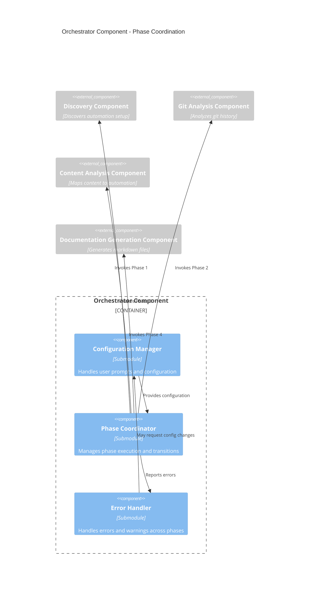

# C4 Component Level: Orchestrator Component

## Overview
- **Name**: Orchestrator Component
- **Description**: Coordinates the 4-phase C5 documentation generation workflow
- **Type**: Application Component (Agent)
- **Technology**: Claude Code Markdown, Claude Opus (claude-opus-4-5-20251101)

## Purpose

The Orchestrator Component serves as the entry point and workflow coordinator for the entire C5 Documentation Generator system. It manages phase transitions, handles user configuration, coordinates data flow between components, and ensures graceful error handling throughout the pipeline.

## Software Features

- **Workflow Coordination**: Orchestrates sequential execution of 4 phases (Discovery → Git Analysis → Content Analysis → Documentation Generation)
- **Phase Transition Management**: Ensures each phase completes successfully before starting the next
- **Configuration Management**: Handles interactive user prompts for output directory, git history inclusion, and custom data file paths
- **Data Flow Management**: Passes structured data between components (AutomationSetup → GitAnalysisResult → ContentAnalysisResult → Documentation files)
- **Error Handling**: Provides graceful degradation when components encounter missing data or errors
- **User Interaction**: Interactive mode with clarifying questions about configuration options
- **Progress Reporting**: Reports phase completion status and overall progress to user

## Code Elements

This component contains the following code-level elements:
- [c5-documentation-generator agent](./c4-code.md#c5-documentation-generator) - Main orchestrator agent implementation

## Interfaces

### User Interface (Interactive)

**Configuration Prompts**:
- `promptOutputDirectory(): string` - Asks user for output directory (default: "docs/architecture/")
- `promptIncludeGitHistory(): boolean` - Asks whether to analyze git history (default: true)
- `promptDataFilePaths(): string[]` - Asks for custom data file paths (optional)
- `promptTimeRange(): string` - Asks how far back to search git history (default: "3 months ago")

### Component Orchestration Interface

**Phase Invocation Operations**:
- `invokePhase1Discovery(): AutomationSetup` - Invokes Discovery Component, returns automation setup data
- `invokePhase2GitAnalysis(dataFilePaths: string[], timeRange: string): GitAnalysisResult` - Invokes Git Analysis Component with parameters
- `invokePhase3ContentAnalysis(setup: AutomationSetup, gitResult: GitAnalysisResult): ContentAnalysisResult` - Invokes Content Analysis Component with aggregated data
- `invokePhase4Documentation(setup: AutomationSetup, gitResult: GitAnalysisResult, contentResult: ContentAnalysisResult, outputDir: string): DocumentationResult` - Invokes Documentation Generation Component with all collected data

**Data Structures**:
```typescript
interface AutomationSetup {
  agents: Agent[];
  skills: Skill[];
  hooks: Hook[];
  mcps: MCP[];
  dataFiles: string[];
  claudeDirectory: string;
  errors?: string[];
  warnings?: string[];
}

interface GitAnalysisResult {
  commits: Commit[];
  summary: CommitSummary;
  warnings?: string[];
  errors?: string[];
}

interface ContentAnalysisResult {
  contentTypes: ContentType[];
  summary: ContentSummary;
  warnings?: string[];
}

interface DocumentationResult {
  filesCreated: string[];
  filesUpdated: string[];
  success: boolean;
  warnings?: string[];
  errors?: string[];
}
```

## Dependencies

### Components Used
- **Discovery Component** (Phase 1): Discovers automation setup in .claude/ directory
- **Git Analysis Component** (Phase 2): Analyzes git commit history for automation patterns
- **Content Analysis Component** (Phase 3): Maps content items to agents/skills
- **Documentation Generation Component** (Phase 4): Generates markdown documentation files

### External Systems
- **Claude Code Platform**: Execution environment for agent
- **File System**: Validates .claude/ directory existence, checks output directory
- **User Terminal**: Interactive configuration prompts

## Component Diagram



## Workflow Algorithm

```
1. Initialize orchestrator
2. Validate .claude/ directory exists
   - If missing → Error: "No .claude/ directory found. Set up Claude Code first."
   - If exists → Continue

3. Collect Configuration
   - Prompt for outputDir (default: "docs/architecture/")
   - Prompt for includeGitHistory (default: true)
   - Prompt for custom dataFilePaths (optional)
   - If includeGitHistory: Prompt for timeRange (default: "3 months ago")

4. Execute Phase 1: Discovery
   - Invoke Discovery Component
   - Receive AutomationSetup data
   - If errors → Report to user, optionally abort
   - If warnings → Report to user, continue
   - Store AutomationSetup for later phases

5. Execute Phase 2: Git Analysis (Conditional)
   - If includeGitHistory is false → Skip Phase 2, use empty GitAnalysisResult
   - If includeGitHistory is true:
     - Invoke Git Analysis Component with dataFilePaths, timeRange
     - Receive GitAnalysisResult data
     - If errors → Report to user, optionally skip
     - If warnings → Report to user, continue
     - Store GitAnalysisResult for later phases

6. Execute Phase 3: Content Analysis
   - Invoke Content Analysis Component with AutomationSetup, GitAnalysisResult
   - Receive ContentAnalysisResult data
   - If errors → Report to user, optionally abort
   - If warnings → Report to user, continue
   - Store ContentAnalysisResult for Phase 4

7. Execute Phase 4: Documentation Generation
   - Invoke Documentation Generation Component with all collected data
   - Receive DocumentationResult (filesCreated, filesUpdated, success status)
   - If errors → Report to user, note partial completion
   - If warnings → Report to user
   - Report success and list files created

8. Final Report
   - Display summary: "Generated X files in Y seconds"
   - List created files with absolute paths
   - Display any accumulated warnings or errors
   - Provide navigation links to generated docs
```

## Configuration

**Model Configuration**:
- Model: Claude Opus (claude-opus-4-5-20251101)
- Token Budget: 50,000-100,000 tokens per run
- Interactive Mode: Enabled
- Cost: Optimized for complex multi-phase analysis

**Default Configuration**:
```json
{
  "outputDir": "docs/architecture/",
  "includeGitHistory": true,
  "timeRange": "3 months ago",
  "dataFilePaths": null,
  "exampleLimit": 3
}
```

## Error Handling

**Error Types**:
1. **Missing .claude/ directory** → Abort with setup instructions
2. **No agents or skills found** → Warning, continue with empty arrays
3. **Git repository not found** → Offer to skip Phase 2
4. **Phase failure** → Report error, optionally skip phase or abort
5. **Data missing between phases** → Use empty/default data, add warning

**Error Recovery Strategy**:
- Graceful degradation: Continue pipeline with partial data
- User choice: Offer to skip optional phases (git analysis)
- Informative errors: Provide actionable error messages with suggestions

## Performance Characteristics

- **Total Runtime**: 20-40 seconds for typical projects
  - Phase 1: ~5-10 seconds
  - Phase 2: ~5-10 seconds
  - Phase 3: ~5-10 seconds
  - Phase 4: ~5-10 seconds
- **Token Usage**: 50,000-100,000 tokens (varies by project size)
- **Memory**: Minimal (streaming data between phases)
- **I/O**: Read-heavy (git, file system), write at end (Phase 4 only)

## Usage Examples

**Example 1: Basic Usage**
```bash
/agent c5-documentation-generator
# Follows all prompts with default values
# Generates complete C5 documentation
```

**Example 2: Custom Output Directory**
```
User: /agent c5-documentation-generator
Agent: Where should I save the C5 documentation? (default: docs/architecture/)
User: docs/c5/
Agent: [Proceeds with custom output directory]
```

**Example 3: Skip Git History**
```
Agent: Should I analyze git commit history? (default: yes)
User: no
Agent: [Skips Phase 2, proceeds with Phases 1, 3, 4]
```

## Related Components

- **[Discovery Component](./c4-component-discovery.md)** - Phase 1 execution
- **[Git Analysis Component](./c4-component-git-analysis.md)** - Phase 2 execution
- **[Content Analysis Component](./c4-component-content-analysis.md)** - Phase 3 execution
- **[Documentation Generation Component](./c4-component-documentation-generation.md)** - Phase 4 execution

---

**Component Documentation Generated**: January 2026  
**Component Version**: 1.0.0  
**System Version**: C5 Documentation Generator v1.0.0
