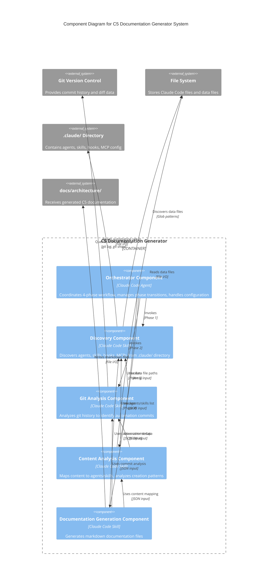

# C4 Component Level: C5 Documentation Generator System

## System Overview

The C5 Documentation Generator is a pipeline-based automation documentation system consisting of 5 logical components that work together to discover, analyze, and document Claude Code automation usage patterns.

## Components

### 1. Orchestrator Component
- **Name**: Orchestrator Component
- **Description**: Coordinates the 4-phase documentation generation workflow
- **Documentation**: [c4-component-orchestrator.md](./c4-component-orchestrator.md)

### 2. Discovery Component
- **Name**: Discovery Component
- **Description**: Discovers and catalogs all Claude Code automation setup
- **Documentation**: [c4-component-discovery.md](./c4-component-discovery.md)

### 3. Git Analysis Component
- **Name**: Git Analysis Component
- **Description**: Analyzes git commit history to identify automation patterns
- **Documentation**: [c4-component-git-analysis.md](./c4-component-git-analysis.md)

### 4. Content Analysis Component
- **Name**: Content Analysis Component
- **Description**: Maps content items to the agents and skills that created them
- **Documentation**: [c4-component-content-analysis.md](./c4-component-content-analysis.md)

### 5. Documentation Generation Component
- **Name**: Documentation Generation Component
- **Description**: Generates comprehensive markdown documentation from collected data
- **Documentation**: [c4-component-documentation-generation.md](./c4-component-documentation-generation.md)

## Component Relationships



## Pipeline Architecture

The system follows a linear pipeline pattern where each component's output feeds into the next:

```
Discovery → Git Analysis → Content Analysis → Documentation Generation
    ↓            ↓              ↓                    ↓
AutomationSetup  GitAnalysis   ContentAnalysis   Markdown Files
```

The Orchestrator Component manages this pipeline, ensuring phase transitions occur correctly and handling configuration and error conditions.

## Key Design Principles

1. **Pipeline Pattern**: Linear 4-phase workflow with clear data dependencies
2. **Separation of Concerns**: Each component has a single, well-defined responsibility
3. **Data-Driven Design**: Components communicate through structured JSON data
4. **Graceful Degradation**: Components handle missing data without failing entire pipeline
5. **Template-Based Output**: Documentation generation uses parameterized templates

## Technology Stack

- **Platform**: Claude Code (Anthropic)
- **Model**: Claude Opus (claude-opus-4-5-20251101)
- **Primary Language**: Claude Code Markdown (procedural workflow definitions)
- **Supporting Tools**: Bash (git operations), Regex (parsing), JSON (data exchange)
- **Output Format**: Markdown with Mermaid diagrams

## Documentation Navigation

- **[Component Details: Orchestrator](./c4-component-orchestrator.md)** - Workflow coordination and phase management
- **[Component Details: Discovery](./c4-component-discovery.md)** - Automation setup discovery
- **[Component Details: Git Analysis](./c4-component-git-analysis.md)** - Git history analysis
- **[Component Details: Content Analysis](./c4-component-content-analysis.md)** - Content-to-automation mapping
- **[Component Details: Documentation Generation](./c4-component-documentation-generation.md)** - Markdown file generation

## Related Documentation

- **[C4 Code Level](./c4-code.md)** - Detailed code-level documentation
- **[C5 README](./c5-README.md)** - Generated C5 documentation overview

---

**C4 Component Documentation Generated**: January 2026  
**Documentation Version**: 1.0.0  
**System Version**: C5 Documentation Generator v1.0.0
