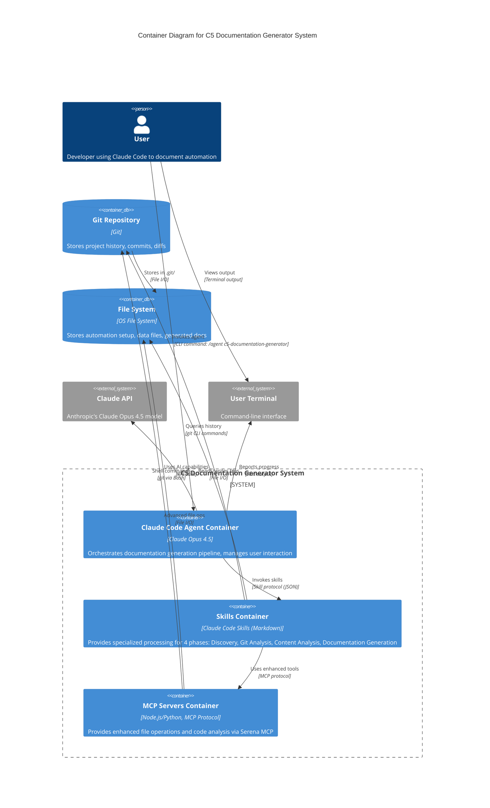

# C4 Container Level: C5 Documentation Generator System Deployment

## Containers

### Claude Code Agent Container
- **Name**: Claude Code Agent Container
- **Description**: Runtime environment executing the orchestrator agent and coordinating the documentation generation pipeline
- **Type**: Agent Runtime / Application Container
- **Technology**: Claude Code Platform (Anthropic), Claude Opus 4.5 (claude-opus-4-5-20251101)
- **Deployment**: Desktop application (Claude Code CLI)

#### Purpose
The Claude Code Agent Container is the primary execution environment for the C5 Documentation Generator. It hosts the orchestrator agent that coordinates the 4-phase pipeline, manages user interactions, handles configuration, and invokes skills. This container is a conversational AI agent that operates within the Claude Code platform, providing an interactive command-line interface for users to generate documentation.

#### Components
This container deploys the following components:
- **Orchestrator Component**: Coordinates the 4-phase workflow, manages phase transitions, and handles configuration
  - Documentation: [c4-component-orchestrator.md](./c4-component-orchestrator.md)

#### Interfaces

##### User CLI Interface
- **Protocol**: Interactive command-line interface
- **Description**: Provides conversational interaction for configuration and execution
- **Endpoints**:
  - `/agent c5-documentation-generator` - Starts the documentation generation process
  - Interactive prompts for configuration (output directory, git history inclusion, etc.)
  - Progress reporting and status updates

##### Skill Invocation API (Internal)
- **Protocol**: Claude Code Skill Invocation Protocol
- **Description**: Internal API for invoking skills within the Claude Code platform
- **Operations**:
  - `invokeSkill(skillName: string, parameters: object): Promise<object>` - Invokes a skill and receives structured response
  - Skills invoked: `c5-discover-automation`, `c5-analyze-git-history`, `c5-analyze-content`, `c5-generate-docs`

#### Dependencies

##### Containers Used
- **Skills Container**: Invokes Phase 1-4 skills for specialized processing (JSON-based communication)
- **MCP Servers Container**: Uses Serena MCP for file operations and code analysis (MCP protocol)
- **Git Repository**: Reads commit history and file changes (git CLI commands)
- **File System**: Reads automation setup files and writes documentation (file I/O)

##### External Systems
- **Claude API**: Claude Opus 4.5 model for AI capabilities
- **User Terminal**: Interactive input/output

#### Infrastructure
- **Deployment Config**: Installed as part of Claude Code desktop application
- **Scaling**: Single-instance per user session (not horizontally scalable)
- **Resources**:
  - Token Budget: 50,000-100,000 tokens per execution
  - Memory: ~200MB for conversation context
  - CPU: Low (model execution is remote)
  - Runtime: 20-40 seconds per execution

---

### Skills Container
- **Name**: Skills Container
- **Description**: Collection of specialized processing skills for discovery, analysis, and generation
- **Type**: Service Library / Skill Collection
- **Technology**: Claude Code Markdown (skill definitions), Bash (for git operations), Regex (for parsing)
- **Deployment**: Stored as markdown files in `.claude/skills/` directory, invoked by orchestrator agent

#### Purpose
The Skills Container provides the specialized capabilities for each phase of the documentation generation pipeline. Each skill is a self-contained module that performs a specific task (discovery, git analysis, content analysis, or documentation generation) and returns structured data to the orchestrator.

#### Components
This container deploys the following components:
- **Discovery Component** (Phase 1): Discovers agents, skills, hooks, MCPs from `.claude/` directory
  - Documentation: [c4-component-discovery.md](./c4-component-discovery.md)
- **Git Analysis Component** (Phase 2): Analyzes git history to identify automation commits
  - Documentation: [c4-component-git-analysis.md](./c4-component-git-analysis.md)
- **Content Analysis Component** (Phase 3): Maps content to agents/skills, analyzes creation patterns
  - Documentation: [c4-component-content-analysis.md](./c4-component-content-analysis.md)
- **Documentation Generation Component** (Phase 4): Generates markdown documentation files
  - Documentation: [c4-component-documentation-generation.md](./c4-component-documentation-generation.md)

#### Interfaces

##### Skill Execution API
- **Protocol**: Claude Code Skill Protocol (text-based invocation with JSON data exchange)
- **Description**: Each skill provides a structured input/output interface
- **Skill Endpoints**:
  - **Phase 1: Discovery**
    - Input: None
    - Output: `AutomationSetup` (JSON with agents, skills, hooks, MCPs, dataFiles)
  - **Phase 2: Git Analysis**
    - Input: `dataFilePaths: string[]`, `timeRange: string`
    - Output: `GitAnalysisResult` (JSON with commits, summary)
  - **Phase 3: Content Analysis**
    - Input: `AutomationSetup`, `GitAnalysisResult`
    - Output: `ContentAnalysisResult` (JSON with contentTypes, summary)
  - **Phase 4: Documentation Generation**
    - Input: `AutomationSetup`, `GitAnalysisResult`, `ContentAnalysisResult`, `outputDir: string`
    - Output: `DocumentationResult` (JSON with filesCreated, filesUpdated, success)

##### File System API (Internal)
- **Protocol**: File I/O operations via Claude Code tools
- **Description**: Read/write access to project files
- **Operations**:
  - `Glob(pattern: string)` - Find files matching pattern
  - `Read(file_path: string)` - Read file contents
  - `Write(file_path: string, content: string)` - Write file contents

##### Git CLI API (Internal)
- **Protocol**: Bash command execution for git operations
- **Description**: Query git repository for commit history and diffs
- **Operations**:
  - `git log --all --oneline --since="<timeRange>"` - Search commit history
  - `git show <hash> --name-only` - Get files changed
  - `git diff <hash>^ <hash> -- <file>` - Get diff for specific file

#### Dependencies

##### Containers Used
- **Git Repository**: Queries commit history and file changes
- **File System**: Reads automation files and data files, writes documentation
- **MCP Servers Container**: Uses Serena MCP for advanced file operations

##### External Systems
- **Claude Code Platform**: Skill execution environment

#### Infrastructure
- **Deployment Config**: Markdown files in `.claude/skills/` directory
  - `c5-discover-automation.md`
  - `c5-analyze-git-history.md`
  - `c5-analyze-content.md`
  - `c5-generate-docs.md`
- **Scaling**: Invoked sequentially (one skill at a time)
- **Resources**:
  - File Operations: 10-50 reads, 5-7 writes per execution
  - Git Operations: 3N+1 commands (N = number of commits)
  - Memory: Minimal (streaming data between skills)
  - Runtime: 5-10 seconds per skill

---

### MCP Servers Container
- **Name**: MCP Servers Container
- **Description**: Model Context Protocol servers providing specialized capabilities for file operations and code analysis
- **Type**: Service Layer / MCP Server Collection
- **Technology**: Node.js/Python (MCP server implementations), MCP Protocol (JSON-RPC 2.0)
- **Deployment**: Installed and configured via Claude Code settings, runs as background processes

#### Purpose
The MCP Servers Container provides enhanced capabilities beyond Claude Code's native tools, including advanced file operations, code analysis, and project navigation through the Serena MCP server.

#### Components
MCP servers are external integrations and don't map to internal components. Key server used:
- **Serena MCP**: Code analysis and file operations (used for project structure analysis)

#### Interfaces

##### MCP Protocol API
- **Protocol**: Model Context Protocol (JSON-RPC 2.0)
- **Description**: Standard MCP protocol for tool invocation
- **Specification**: [Model Context Protocol Specification](https://modelcontextprotocol.io/)
- **Operations** (Serena MCP):
  - `read_file(relative_path: string)` - Read file contents
  - `create_text_file(relative_path: string, content: string)` - Create/overwrite file
  - `list_dir(relative_path: string, recursive: bool)` - List directory contents
  - `find_file(file_mask: string, relative_path: string)` - Find files matching pattern
  - `search_for_pattern(substring_pattern: string)` - Search for regex patterns in files
  - `get_symbols_overview(relative_path: string)` - Get code symbols in file
  - `execute_shell_command(command: string)` - Execute shell command

#### Dependencies

##### Containers Used
- **File System**: Provides file access and code analysis capabilities to other containers
- **Git Repository**: Can execute git commands via shell command execution

##### External Systems
- **Claude Code Platform**: MCP integration layer
- **Node.js/Python Runtime**: MCP server execution environment

#### Infrastructure
- **Deployment Config**: Configured in `.claude/settings.local.json`
- **Scaling**: Single-instance per user session
- **Resources**:
  - Memory: ~50MB per MCP server
  - CPU: Low (mostly I/O bound)
  - Network: Local IPC (stdio-based communication)

---

### Git Repository
- **Name**: Git Repository
- **Description**: Version control system storing project history and commit data
- **Type**: Data Store / Version Control System
- **Technology**: Git (distributed version control)
- **Deployment**: Local `.git` directory in project root

#### Purpose
The Git Repository stores the complete history of the project, including all commits, file changes, and metadata. It serves as the source of truth for understanding when content was created, which files were modified, and inferring automation patterns from commit messages and diffs.

#### Components
Git is an external system and doesn't contain internal components.

#### Interfaces

##### Git CLI Interface
- **Protocol**: Git command-line interface
- **Description**: Standard git commands for querying repository history
- **Endpoints**:
  - `git log` - Query commit history
  - `git show` - Show commit details and diffs
  - `git diff` - Show differences between commits
  - `git rev-parse` - Validate git repository

#### Dependencies

##### Used By
- **Skills Container**: Git Analysis Component queries commit history
- **MCP Servers Container**: Can execute git commands via shell

##### External Systems
- **File System**: Git stores data in `.git` directory

#### Infrastructure
- **Deployment Config**: Initialized with `git init` or cloned from remote
- **Scaling**: Single-instance per project (local repository)
- **Resources**:
  - Disk Space: Varies (typically 5-50MB for `.git` directory)
  - I/O: Read-heavy during analysis

---

### File System
- **Name**: File System
- **Description**: Local file system storing automation setup, data files, and generated documentation
- **Type**: Data Store / File Storage
- **Technology**: OS-native file system (APFS on macOS, NTFS on Windows, ext4 on Linux)
- **Deployment**: Local disk storage

#### Purpose
The File System stores all project files, including automation setup files (`.claude/` directory), data files (content arrays), and generated documentation. It serves as the persistent storage layer for both input and output of the documentation generation process.

#### Components
File system is infrastructure and doesn't contain components.

#### Interfaces

##### File I/O Interface
- **Protocol**: POSIX file I/O operations
- **Description**: Standard file system operations
- **Operations**:
  - `read(path: string)` - Read file contents
  - `write(path: string, data: string)` - Write file contents
  - `mkdir(path: string)` - Create directory
  - `readdir(path: string)` - List directory contents
  - `stat(path: string)` - Get file metadata

#### Key Directory Structure
```
project-root/
├── .claude/                           # Automation setup
│   ├── agents/                        # Agent definitions
│   ├── skills/                        # Skill definitions
│   └── settings.local.json           # MCP configuration
├── app/data/                          # Data files (content)
│   ├── blog-posts.ts
│   └── iim-schools-v2.ts
├── docs/architecture/                 # Generated documentation (output)
│   ├── c5-README.md
│   ├── c5-blog-posts.md
│   └── c5-automation-workflows.md
└── .git/                              # Git repository
```

#### Dependencies

##### Used By
- **Claude Code Agent Container**: Reads automation setup, writes documentation
- **Skills Container**: Reads/writes files for all phases
- **MCP Servers Container**: Provides file access via MCP protocol
- **Git Repository**: Stores git data in `.git` directory

##### External Systems
- **Operating System**: Native file system implementation

#### Infrastructure
- **Deployment Config**: N/A (OS-level infrastructure)
- **Scaling**: Local file system (not distributed)
- **Resources**:
  - Disk Space: 50-100KB for generated documentation
  - I/O: High during discovery and generation phases

---

## Container Diagram



## Container Communication Patterns

### 1. User Interaction Flow
```
User → Claude Code Agent Container → User Terminal
      ↓ (configuration prompts)
User ← Claude Code Agent Container ← User Terminal
```

### 2. Pipeline Execution Flow
```
Claude Code Agent Container
  ↓ (invokes Phase 1)
Skills Container → File System (.claude/ directory)
  ↓ (AutomationSetup JSON)
Claude Code Agent Container
  ↓ (invokes Phase 2)
Skills Container → Git Repository (git log, git show)
  ↓ (GitAnalysisResult JSON)
Claude Code Agent Container
  ↓ (invokes Phase 3)
Skills Container → File System (data files)
  ↓ (ContentAnalysisResult JSON)
Claude Code Agent Container
  ↓ (invokes Phase 4)
Skills Container → File System (write docs/)
  ↓ (DocumentationResult JSON)
Claude Code Agent Container → User Terminal (success report)
```

### 3. MCP Enhancement Flow
```
Skills Container → MCP Servers Container → File System
                          ↓
                   (enhanced file operations)
                          ↓
Skills Container ← MCP Servers Container
```

## Deployment Architecture

### Local Development Environment

**Platform**: Desktop (macOS, Windows, Linux)
**Runtime**: Claude Code CLI application

```
┌─────────────────────────────────────────────┐
│           User's Local Machine              │
│                                             │
│  ┌───────────────────────────────────────┐ │
│  │   Claude Code Desktop Application     │ │
│  │                                       │ │
│  │  ┌──────────────────────────────┐   │ │
│  │  │ Agent Container              │   │ │
│  │  │ (Orchestrator)               │   │ │
│  │  └──────────────────────────────┘   │ │
│  │                                       │ │
│  │  ┌──────────────────────────────┐   │ │
│  │  │ Skills Container             │   │ │
│  │  │ (4 Phase Skills)             │   │ │
│  │  └──────────────────────────────┘   │ │
│  │                                       │ │
│  │  ┌──────────────────────────────┐   │ │
│  │  │ MCP Servers Container        │   │ │
│  │  │ (Serena MCP)                 │   │ │
│  │  └──────────────────────────────┘   │ │
│  └───────────────────────────────────────┘ │
│                                             │
│  ┌───────────────────────────────────────┐ │
│  │   File System                         │ │
│  │   .claude/ | app/data/ | docs/       │ │
│  └───────────────────────────────────────┘ │
│                                             │
│  ┌───────────────────────────────────────┐ │
│  │   Git Repository (.git/)              │ │
│  └───────────────────────────────────────┘ │
└─────────────────────────────────────────────┘
         │
         │ HTTPS
         ↓
┌─────────────────────────────────────────────┐
│     Anthropic Cloud (Remote)                │
│   Claude Opus 4.5 Model                     │
└─────────────────────────────────────────────┘
```

### Container Startup Sequence

1. **Claude Code Application Starts**
   - Loads MCP server configurations from `.claude/settings.local.json`
   - Initializes MCP Servers Container (Serena MCP)
   - Connects to Claude API (Anthropic)

2. **User Invokes Agent**
   - User runs: `/agent c5-documentation-generator`
   - Claude Code Agent Container starts orchestrator agent
   - Agent loads skills from `.claude/skills/` directory

3. **Pipeline Execution**
   - Agent Container invokes Skills Container (Phase 1-4)
   - Skills Container uses MCP Servers Container for file operations
   - Skills Container queries Git Repository for commit history
   - Skills Container writes documentation to File System

4. **Completion**
   - Agent Container reports success to User Terminal
   - Lists generated documentation files
   - Provides navigation links

## Technology Stack Summary

### Container Technologies

| Container | Primary Technology | Secondary Technologies | Runtime |
|-----------|-------------------|----------------------|---------|
| **Claude Code Agent Container** | Claude Opus 4.5 | Claude Code Platform | Desktop app |
| **Skills Container** | Claude Code Markdown | Bash, Regex, JSON | Interpreted by Claude |
| **MCP Servers Container** | Node.js/Python | MCP Protocol (JSON-RPC 2.0) | Background processes |
| **Git Repository** | Git | - | Local filesystem |
| **File System** | OS File System | - | OS-level |

### Communication Protocols

| From Container | To Container | Protocol | Data Format |
|---------------|--------------|----------|-------------|
| Agent → Skills | Skill invocation | Claude Code Skill Protocol | Text + JSON |
| Agent → User | Progress reporting | Terminal I/O | Text |
| Skills → MCP | Tool invocation | MCP (JSON-RPC 2.0) | JSON |
| Skills → Git | Query history | Git CLI (Bash) | Text |
| Skills → File System | Read/write | File I/O (POSIX) | Text/Binary |
| MCP → File System | Enhanced operations | File I/O (POSIX) | Text/Binary |

## Scalability and Performance

### Container Scalability

| Container | Scaling Strategy | Instances | Reason |
|-----------|-----------------|-----------|--------|
| **Agent Container** | Single-instance | 1 per user session | Interactive agent, stateful conversation |
| **Skills Container** | Sequential execution | 1 at a time | Pipeline pattern, each phase depends on previous |
| **MCP Servers Container** | Single-instance | 1 per user session | Local IPC, session-bound |
| **Git Repository** | Not scalable | 1 per project | Local repository, not distributed |
| **File System** | Not scalable | 1 per machine | Local storage |

### Performance Characteristics

| Container | Typical Latency | Throughput | Bottleneck |
|-----------|----------------|------------|------------|
| **Agent Container** | 20-40s total | 1 execution/session | Claude API calls, token budget |
| **Skills Container** | 5-10s per skill | Sequential (not parallel) | Git operations, file I/O |
| **MCP Servers Container** | <1s per operation | 10-50 ops/execution | File system I/O |
| **Git Repository** | 1-5s for queries | 3N+1 git commands | Commit count, history depth |
| **File System** | <100ms per operation | 10-50 reads, 5-7 writes | Disk I/O speed |

## Security and Access Control

### Container Permissions

**Agent Container**:
- Read access to `.claude/` directory
- Read/write access to output directory (`docs/architecture/`)
- No network access (except Claude API)

**Skills Container**:
- Read access to entire project (for discovery)
- Write access to output directory only
- Git read-only access (no commits or pushes)
- Bash access for git commands

**MCP Servers Container**:
- Configured permissions in `.claude/settings.local.json`:
  ```json
  {
    "permissions": {
      "allow": [
        "mcp__plugin_serena_serena__read_file",
        "mcp__plugin_serena_serena__create_text_file",
        "Bash(ls:*)"
      ]
    }
  }
  ```
- File system access controlled by MCP permissions
- No external network access

**Git Repository**:
- Read-only access from Skills Container
- No write operations (no commits, pushes, or repository modifications)

**File System**:
- Read access: Entire project
- Write access: Output directory only (`docs/architecture/`)
- No access to system files outside project

### Data Flow Security

```
User Input (CLI) → Agent Container → Skills Container → File System (write)
                                    ↓
                              Git Repository (read-only)
```

No external network connections except:
- Agent Container → Claude API (HTTPS, authenticated)

## Monitoring and Observability

### Container Logging

| Container | Log Location | Log Level | Log Format |
|-----------|-------------|-----------|------------|
| **Agent Container** | Terminal output | INFO/WARN/ERROR | Plain text |
| **Skills Container** | Embedded in agent logs | INFO/WARN/ERROR | Structured (warnings/errors arrays in JSON) |
| **MCP Servers Container** | Stdout/stderr | DEBUG/INFO/ERROR | JSON-RPC 2.0 |
| **Git Repository** | N/A (query results in Skills logs) | N/A | N/A |
| **File System** | OS-level | N/A | N/A |

### Health Checks

**Agent Container**:
- Check: `.claude/` directory exists
- Check: Agents and skills are loadable
- Check: Claude API connection

**Skills Container**:
- Check: Git repository exists (for Phase 2)
- Check: Data files exist (for Phase 3)
- Check: Output directory is writable (for Phase 4)

**MCP Servers Container**:
- Check: MCP server process is running
- Check: MCP protocol handshake succeeds

**Git Repository**:
- Check: `git rev-parse --git-dir` succeeds

**File System**:
- Check: Output directory exists and is writable
- Check: `.claude/` directory is readable

## Error Handling and Recovery

### Container Error Recovery

| Container | Error Condition | Recovery Strategy |
|-----------|----------------|-------------------|
| **Agent Container** | Missing `.claude/` directory | Abort with setup instructions |
| **Agent Container** | Skill invocation fails | Report error, optionally skip phase |
| **Skills Container** | Git repository not found | Skip Phase 2, continue with Phases 1, 3, 4 |
| **Skills Container** | Data file unreadable | Skip file, add warning, continue |
| **Skills Container** | Cannot write documentation | Report error, partial completion |
| **MCP Servers Container** | MCP server not responding | Fall back to native Claude Code tools |
| **Git Repository** | Commit parsing fails | Skip commit, add warning, continue |
| **File System** | Write permission denied | Report error, abort Phase 4 |

### Graceful Degradation

The system is designed for graceful degradation:
1. **Phase 2 optional**: If git repository unavailable, skip Phase 2, continue with Phases 1, 3, 4
2. **Partial data acceptable**: Missing data results in "N/A" or "Unknown" in documentation, not failure
3. **File-level recovery**: If one data file fails, continue processing other files
4. **Commit-level recovery**: If one commit fails to parse, continue processing other commits

## Deployment Requirements

### System Requirements

**Minimum**:
- OS: macOS 10.15+, Windows 10+, or Linux (Ubuntu 20.04+)
- RAM: 4GB
- Disk Space: 1GB for Claude Code + 100MB for project
- Git: Version 2.20+

**Recommended**:
- OS: macOS 13+, Windows 11+, or Linux (Ubuntu 22.04+)
- RAM: 8GB
- Disk Space: 2GB for Claude Code + 500MB for project
- Git: Version 2.30+

### Installation Steps

1. **Install Claude Code**:
   ```bash
   # Download from Anthropic website
   # Install desktop application
   ```

2. **Configure MCP Servers** (if using Serena MCP):
   ```json
   // .claude/settings.local.json
   {
     "permissions": {
       "allow": [
         "mcp__plugin_serena_serena__read_file",
         "mcp__plugin_serena_serena__create_text_file"
       ]
     }
   }
   ```

3. **Install Skills**:
   ```bash
   # Place skill markdown files in .claude/skills/
   cp c5-*.md .claude/skills/
   ```

4. **Install Agent**:
   ```bash
   # Place agent markdown file in .claude/agents/
   cp c5-documentation-generator.md .claude/agents/
   ```

5. **Verify Installation**:
   ```bash
   # Start Claude Code
   # Run: /agent c5-documentation-generator
   ```

## Container Lifecycle

### Startup
1. Claude Code application launches
2. MCP servers initialize (Serena MCP)
3. User invokes agent via CLI
4. Agent Container loads orchestrator agent
5. Skills Container skills are loaded into memory
6. Pipeline execution begins

### Runtime
1. Agent Container coordinates phases sequentially
2. Skills Container executes one skill at a time
3. MCP Servers Container provides file operations on-demand
4. Git Repository queried multiple times during Phase 2
5. File System accessed throughout all phases

### Shutdown
1. Documentation generation completes
2. Agent Container reports results to terminal
3. Skills Container unloaded from memory
4. MCP Servers Container remains active (session-bound)
5. Claude Code application continues running

## Related Documentation

- **[C4 Component Level](./c4-component.md)** - Component-level architecture
- **[Component: Orchestrator](./c4-component-orchestrator.md)** - Orchestrator component details
- **[Component: Discovery](./c4-component-discovery.md)** - Discovery component details
- **[Component: Git Analysis](./c4-component-git-analysis.md)** - Git analysis component details
- **[Component: Content Analysis](./c4-component-content-analysis.md)** - Content analysis component details
- **[Component: Documentation Generation](./c4-component-documentation-generation.md)** - Documentation generation component details
- **[C4 Code Level](./c4-code.md)** - Code-level documentation

---

**C4 Container Documentation Generated**: 2026-01-13
**Documentation Version**: 1.0.0
**System Version**: C5 Documentation Generator v1.0.0
