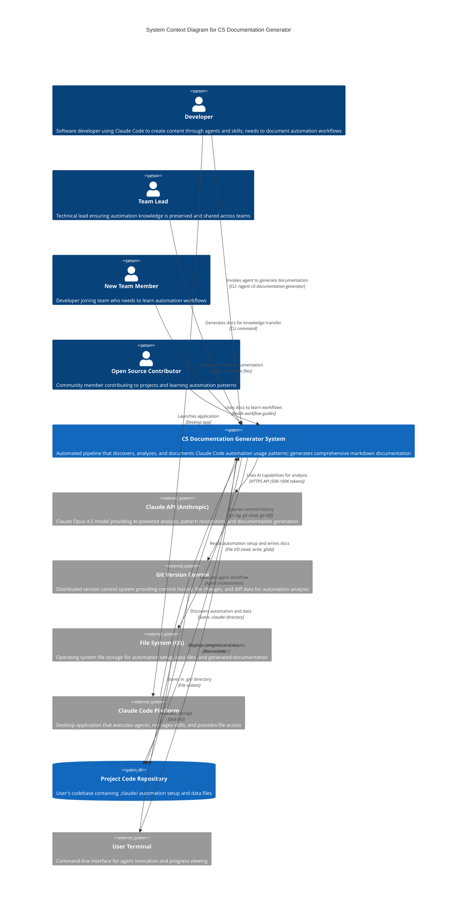

# C4 Context Level: System Context

## System Overview

### Short Description
An automated documentation system that generates comprehensive C5 (Claude Code Usage) documentation by discovering, analyzing, and documenting automation patterns in any codebase.

### Long Description
The C5 Documentation Generator System is a sophisticated pipeline-based tool that solves the "tribal knowledge" problem in software development. When developers use Claude Code to create content through agents, skills, and MCPs, the knowledge of HOW they created it often remains undocumented. This system automatically discovers all Claude Code automation setup, analyzes git commit history to identify usage patterns, maps content items to their creating agents, and generates comprehensive "automation recipe book" documentation.

The system enables teams to transfer institutional knowledge about automation workflows, onboard new developers faster, and replicate successful content creation processes. It works universally across any codebase, programming language, or framework, requiring only a `.claude/` directory with at least one agent or skill.

**Problem Solved**: When developers leave or teams scale, automation knowledge is lost. The C5 system captures and documents actual automation usage patterns so anyone can replicate the workflows.

**Business Value**: Reduces onboarding time from weeks to hours, preserves institutional knowledge, enables process replication across teams, and creates searchable documentation of all automation patterns.

## Personas

### Developer (Human User)
- **Type**: Human User
- **Description**: Software developers who use Claude Code to create content (blog posts, pages, data, code) through agents and skills. They need to document their automation workflows for team knowledge transfer.
- **Goals**:
  - Document which agents/skills were used to create which content
  - Transfer automation knowledge to team members
  - Create replicable workflows for content creation
  - Reduce onboarding time for new team members
- **Key Features Used**: All features (full pipeline execution)
- **Pain Points**: Manual documentation is time-consuming and often incomplete; knowledge lives only in their heads
- **User Journey**: [Generate Complete Documentation Journey](#generate-complete-documentation-journey)

### Team Lead (Human User)
- **Type**: Human User
- **Description**: Technical leads who need to ensure automation knowledge is preserved and shared across the team. They want visibility into automation usage patterns and standardized documentation.
- **Goals**:
  - Ensure automation workflows are documented
  - Standardize documentation across projects
  - Enable knowledge transfer when team members leave
  - Track automation adoption and usage patterns
- **Key Features Used**: All features, focusing on automation statistics and workflow analysis
- **Pain Points**: Teams lose productivity when key developers leave; inconsistent documentation practices across projects
- **User Journey**: [Team Knowledge Transfer Journey](#team-knowledge-transfer-journey)

### New Team Member (Human User)
- **Type**: Human User
- **Description**: Developers joining an existing team who need to understand how content is created and which automation tools are available.
- **Goals**:
  - Quickly understand available automation tools
  - Learn step-by-step workflows for content creation
  - Replicate existing automation patterns
  - Contribute content without reinventing processes
- **Key Features Used**: Reading generated C5 documentation (consumer of system output)
- **Pain Points**: Steep learning curve; unclear which agents/skills to use; no examples of actual usage
- **User Journey**: [Onboarding and Learning Journey](#onboarding-and-learning-journey)

### Open Source Contributor (Human User)
- **Type**: Human User
- **Description**: Community members contributing to open source projects who need to understand the project's automation setup and workflows.
- **Goals**:
  - Understand project automation patterns
  - Contribute content following established patterns
  - Share automation knowledge with community
  - Improve automation workflows
- **Key Features Used**: Discovery and documentation generation features
- **Pain Points**: Lack of automation documentation in most projects; hard to contribute without understanding workflows
- **User Journey**: [Contributor Onboarding Journey](#contributor-onboarding-journey)

### Claude Code Platform (Programmatic User)
- **Type**: Programmatic User / External System
- **Description**: The Claude Code desktop application that executes the C5 agent and provides AI capabilities through Claude Opus 4.5. It orchestrates agent execution, manages skill invocation, and provides file system access.
- **Goals**:
  - Execute the C5 agent workflow
  - Provide AI-powered analysis and generation
  - Manage phase transitions and data flow
  - Ensure token budget constraints
- **Key Features Used**: Agent orchestration, skill execution, AI model invocation
- **Integration Type**: Native platform integration (the system runs within Claude Code)
- **User Journey**: [Automated Execution Journey](#automated-execution-journey)

### Git Version Control System (Programmatic User)
- **Type**: Programmatic User / External System
- **Description**: Git repository that provides commit history, file changes, and diff data for analyzing automation patterns and content creation.
- **Goals**:
  - Provide commit history for analysis
  - Supply file change information
  - Enable pattern recognition through diffs
  - Track content creation timeline
- **Key Features Used**: Git history analysis (Phase 2)
- **Integration Type**: CLI-based queries (git log, git show, git diff)
- **User Journey**: [Git History Analysis Journey](#git-history-analysis-journey)

### Operating System (Programmatic User)
- **Type**: Programmatic User / External System
- **Description**: The underlying OS (macOS, Windows, Linux) that provides file system access for reading automation setup, data files, and writing documentation.
- **Goals**:
  - Provide file system access
  - Enable directory traversal and file operations
  - Store generated documentation
  - Manage file permissions
- **Key Features Used**: All features (file operations throughout pipeline)
- **Integration Type**: File I/O operations (read, write, glob, mkdir)
- **User Journey**: [File System Operations Journey](#file-system-operations-journey)

## System Features

### Feature 1: Automation Discovery
- **Description**: Automatically discovers all Claude Code automation setup by scanning the `.claude/` directory for agents, skills, hooks, and MCP server configurations
- **Users**: Developers, Team Leads, Open Source Contributors
- **User Journey**: [Generate Complete Documentation Journey](#generate-complete-documentation-journey), steps 1-2
- **Business Value**: Eliminates manual cataloging; ensures complete automation inventory
- **Key Capabilities**:
  - Discovers agent files (`.claude/agents/*.md`)
  - Discovers skill files (`.claude/skills/*.md`)
  - Discovers hookify hooks (`.claude/hookify.*.md`)
  - Parses MCP configuration (`.claude/settings.local.json`)
  - Auto-detects data files in common locations

### Feature 2: Git History Analysis
- **Description**: Analyzes git commit history to identify automation-related commits, extract content creation patterns, and infer which agents were used
- **Users**: Developers, Team Leads
- **User Journey**: [Generate Complete Documentation Journey](#generate-complete-documentation-journey), step 3
- **Business Value**: Provides evidence-based automation usage data; shows actual adoption patterns
- **Key Capabilities**:
  - Searches commits for automation keywords
  - Extracts files changed and line counts
  - Infers agent usage from commit messages
  - Identifies content slugs from diffs
  - Calculates automation statistics (batch sizes, frequencies)

### Feature 3: Content-to-Automation Mapping
- **Description**: Maps content items (blog posts, pages, data entries) to the specific agents, skills, and MCPs that created them
- **Users**: Developers, New Team Members
- **User Journey**: [Onboarding and Learning Journey](#onboarding-and-learning-journey), steps 3-4
- **Business Value**: Creates clear causality between automation and content; enables precise workflow replication
- **Key Capabilities**:
  - Identifies content types from data files
  - Counts content items per type
  - Correlates content with git commits
  - Infers agents/skills/MCPs used
  - Analyzes creation patterns (batch, incremental, bulk)
  - Extracts real examples with metadata

### Feature 4: Documentation Generation
- **Description**: Generates comprehensive markdown documentation with navigation, workflow guides, examples, and statistics
- **Users**: All personas
- **User Journey**: [Generate Complete Documentation Journey](#generate-complete-documentation-journey), step 4
- **Business Value**: Creates searchable, navigable documentation; reduces documentation maintenance overhead
- **Key Capabilities**:
  - Generates C5 README with overview and navigation
  - Creates per-content-type workflow documentation
  - Generates master automation workflows reference
  - Updates architecture documentation with C5 links
  - Includes real examples and git commit references
  - Provides troubleshooting and extension guides

### Feature 5: Interactive Configuration
- **Description**: Provides interactive CLI prompts for configuration options like output directory, git history inclusion, and custom data file paths
- **Users**: Developers, Team Leads
- **User Journey**: [Generate Complete Documentation Journey](#generate-complete-documentation-journey), step 1
- **Business Value**: Enables customization without code changes; adapts to different project structures
- **Key Capabilities**:
  - Configurable output directory
  - Optional git history analysis
  - Custom data file path specification
  - Time range filtering for git analysis
  - Example limit per content type

### Feature 6: Automation Statistics
- **Description**: Calculates and displays automation adoption metrics, batch statistics, and content creation patterns
- **Users**: Team Leads, Developers
- **User Journey**: [Team Knowledge Transfer Journey](#team-knowledge-transfer-journey), step 3
- **Business Value**: Provides visibility into automation ROI; tracks adoption across teams
- **Key Capabilities**:
  - Automation percentage (automated vs manual items)
  - Commit statistics (automation vs manual commits)
  - Batch size and frequency analysis
  - Date range tracking
  - Most active agents identification

## User Journeys

### Generate Complete Documentation Journey
**Persona**: Developer

This journey represents a developer running the C5 agent to generate complete documentation for their project.

1. **Invoke Agent**: Developer opens Claude Code and runs `/agent c5-documentation-generator`
   - **Touchpoint**: Claude Code CLI
   - **System Action**: Orchestrator Component starts, loads agent configuration

2. **Configure Options**: Agent prompts for configuration (output directory, git analysis, data file paths)
   - **Touchpoint**: Interactive CLI prompts
   - **System Action**: Orchestrator Component collects user preferences

3. **Phase 1 - Discovery**: System scans `.claude/` directory and data files
   - **Touchpoint**: File System reads
   - **System Action**: Discovery Component finds agents, skills, hooks, MCPs, data files
   - **Output**: AutomationSetup JSON (agents[], skills[], hooks[], mcps[], dataFiles[])

4. **Phase 2 - Git Analysis**: System analyzes git commit history
   - **Touchpoint**: Git CLI commands
   - **System Action**: Git Analysis Component searches commits, extracts metadata, infers agents
   - **Output**: GitAnalysisResult JSON (commits[], summary)

5. **Phase 3 - Content Analysis**: System maps content to automation tools
   - **Touchpoint**: File System reads (data files)
   - **System Action**: Content Analysis Component correlates content with commits, infers skills/MCPs
   - **Output**: ContentAnalysisResult JSON (contentTypes[], examples[], statistics)

6. **Phase 4 - Documentation**: System generates markdown files
   - **Touchpoint**: File System writes (docs/architecture/)
   - **System Action**: Documentation Generation Component creates 5-7 markdown files
   - **Output**: c5-README.md, c5-{content-type}.md files, c5-automation-workflows.md

7. **View Results**: Developer browses generated documentation
   - **Touchpoint**: File System reads or web browser
   - **System Action**: Developer navigates documentation, follows workflow guides

8. **Share with Team**: Developer commits C5 documentation to git repository
   - **Touchpoint**: Git commit and push
   - **System Action**: Team members access documentation via repository

**Success Criteria**: 5-7 markdown files created in 30-45 seconds; documentation includes real examples and accurate statistics; all placeholders filled

**Common Variations**:
- Skip git analysis for new projects without history
- Specify custom data file paths for non-standard project structures
- Regenerate documentation monthly to capture new automation activity

### Team Knowledge Transfer Journey
**Persona**: Team Lead

This journey represents a team lead using C5 documentation to transfer knowledge when a key developer leaves.

1. **Developer Departure**: Key developer announces departure; team lead needs to preserve automation knowledge
   - **Touchpoint**: Team communication
   - **System Action**: Team lead identifies need for documentation

2. **Generate Documentation**: Team lead runs C5 agent to capture current automation state
   - **Touchpoint**: Claude Code CLI
   - **System Action**: System generates complete C5 documentation (all 4 phases)

3. **Review Statistics**: Team lead reviews automation statistics to understand coverage
   - **Touchpoint**: c5-README.md statistics section
   - **System Action**: Team lead sees 80% automation coverage, identifies gaps

4. **Knowledge Transfer Session**: Team lead uses C5 docs to train remaining team members
   - **Touchpoint**: c5-{content-type}.md workflow guides
   - **System Action**: Team members follow step-by-step guides with real examples

5. **Handoff Documentation**: Team lead adds C5 docs to project wiki/onboarding materials
   - **Touchpoint**: Project wiki (Notion, Confluence, GitHub Pages)
   - **System Action**: New team members access documentation during onboarding

**Success Criteria**: Knowledge transfer complete in 2-3 hours instead of 2-3 weeks; team can replicate automation workflows without original developer

### Onboarding and Learning Journey
**Persona**: New Team Member

This journey represents a new developer joining a team and learning automation workflows through C5 documentation.

1. **Project Onboarding**: New developer clones repository and reads README
   - **Touchpoint**: Project README, architecture/README
   - **System Action**: Developer discovers link to C5 documentation

2. **Discover Automation Tools**: Developer reads c5-README.md to understand available agents/skills
   - **Touchpoint**: c5-README.md
   - **System Action**: Developer sees agent-to-content-type mapping table, navigation links

3. **Learn Specific Workflow**: Developer opens c5-blog-posts.md to learn blog creation workflow
   - **Touchpoint**: c5-blog-posts.md
   - **System Action**: Developer reads step-by-step workflow with real examples

4. **Replicate Workflow**: Developer invokes agent to create new blog post following documented workflow
   - **Touchpoint**: Claude Code CLI + c5-blog-posts.md "How to Create" section
   - **System Action**: Developer successfully creates content using documented agent/skills

5. **Explore Other Workflows**: Developer browses other content-type docs to understand full automation capabilities
   - **Touchpoint**: c5-automation-workflows.md master reference
   - **System Action**: Developer gains comprehensive understanding of all automation tools

**Success Criteria**: New developer creates first content item within 1-2 hours; full productivity within 1-2 days instead of 1-2 weeks

### Contributor Onboarding Journey
**Persona**: Open Source Contributor

This journey represents a community member contributing to an open source project using C5 documentation.

1. **Discover Project**: Contributor finds project on GitHub and wants to contribute content
   - **Touchpoint**: GitHub repository
   - **System Action**: Contributor reads project documentation

2. **Read Automation Guide**: Contributor opens docs/architecture/c5-README.md
   - **Touchpoint**: c5-README.md in GitHub web UI
   - **System Action**: Contributor learns project uses automation for content creation

3. **Understand Workflow**: Contributor reads content-type documentation for desired contribution
   - **Touchpoint**: c5-{content-type}.md
   - **System Action**: Contributor learns which agent/skills to use and how

4. **Set Up Local Environment**: Contributor clones repo, installs Claude Code, configures MCPs
   - **Touchpoint**: Installation guides in c5 docs
   - **System Action**: Contributor replicates project automation setup

5. **Create Content**: Contributor uses documented agent to create content following established patterns
   - **Touchpoint**: Claude Code CLI + workflow guide
   - **System Action**: Contributor creates content matching project style/structure

6. **Submit PR**: Contributor submits pull request with new content
   - **Touchpoint**: GitHub pull request
   - **System Action**: Maintainers review and merge, confident in workflow compliance

**Success Criteria**: Contributor submits first PR within 2-4 hours; content matches project patterns; no back-and-forth on workflow compliance

### Automated Execution Journey
**Persona**: Claude Code Platform (Programmatic)

This journey represents the Claude Code platform executing the C5 agent workflow.

1. **Agent Invocation**: User runs `/agent c5-documentation-generator` command
   - **Integration**: CLI command parsing
   - **System Action**: Claude Code loads agent definition from `.claude/agents/`

2. **Model Initialization**: Claude Code initializes Claude Opus 4.5 model
   - **Integration**: HTTPS API call to Anthropic
   - **System Action**: Establishes model context with 200K token window

3. **Skill Orchestration**: Claude Code invokes 4 skills sequentially
   - **Integration**: Internal skill protocol (Markdown + JSON)
   - **System Action**: Loads skill definitions, passes data between phases

4. **Token Budget Management**: Claude Code tracks token usage across 4 phases
   - **Integration**: Model usage monitoring
   - **System Action**: Ensures 50K-100K token usage stays within limits

5. **File Operations**: Claude Code provides file I/O access to skills
   - **Integration**: File system API wrappers
   - **System Action**: Enables read/write operations with proper permissions

6. **Result Reporting**: Claude Code displays completion message with file links
   - **Integration**: Terminal output formatting
   - **System Action**: User sees success message and documentation links

**Success Criteria**: Agent completes in 30-45 seconds; token usage within budget; no crashes or errors

### Git History Analysis Journey
**Persona**: Git Version Control System (Programmatic)

This journey represents Git providing commit history data for automation analysis.

1. **Repository Validation**: System checks git repository exists
   - **Integration**: `git rev-parse --git-dir` command
   - **System Action**: Git confirms repository is valid

2. **Commit Search**: System queries commits for automation patterns
   - **Integration**: `git log --all --oneline --since="3 months ago" --grep="feat:"` command
   - **System Action**: Git returns matching commits with hash, date, author, message

3. **File Change Extraction**: System requests files changed for each commit
   - **Integration**: `git show {hash} --name-only` command
   - **System Action**: Git returns list of modified files

4. **Diff Analysis**: System requests diffs to extract content slugs
   - **Integration**: `git diff {hash}^ {hash} -- {filepath}` command
   - **System Action**: Git returns line-by-line diff output

5. **Metadata Assembly**: System combines commit metadata with file changes
   - **Integration**: Bash command parsing
   - **System Action**: System builds GitAnalysisResult JSON

**Success Criteria**: All automation commits found; file changes extracted; diffs available for slug extraction; no git command errors

### File System Operations Journey
**Persona**: Operating System (Programmatic)

This journey represents the OS providing file system access throughout the pipeline.

1. **Discovery Phase**: System scans `.claude/` directory structure
   - **Integration**: Directory traversal (readdir, stat operations)
   - **System Action**: OS returns directory contents and file metadata

2. **File Reading**: System reads agent, skill, data file contents
   - **Integration**: File read operations (read, open, close)
   - **System Action**: OS returns file contents as text

3. **Pattern Matching**: System searches for files matching glob patterns
   - **Integration**: Glob expansion (*.md, **/*.ts patterns)
   - **System Action**: OS returns matching file paths

4. **Directory Creation**: System creates output directory if needed
   - **Integration**: mkdir -p command
   - **System Action**: OS creates directory hierarchy

5. **Documentation Writing**: System writes 5-7 markdown files
   - **Integration**: File write operations
   - **System Action**: OS persists files to disk with proper permissions

6. **File Update**: System updates existing README with C5 section
   - **Integration**: Read-modify-write pattern
   - **System Action**: OS reads file, allows modification, writes back

**Success Criteria**: All file operations complete successfully; output directory created; markdown files written; no permission errors

## External Systems and Dependencies

### Claude API (Anthropic)
- **Type**: Cloud Service / AI Model Provider
- **Description**: Anthropic's Claude Opus 4.5 model (claude-opus-4-5-20251101) that powers the AI capabilities for analysis and generation
- **Integration Type**: HTTPS API calls (RESTful)
- **Purpose**: Provides sophisticated language understanding and generation capabilities for complex multi-phase analysis, pattern recognition, and documentation generation
- **Data Exchanged**:
  - Inbound: User prompts, skill instructions, file contents, git output
  - Outbound: Analysis results, generated documentation, structured JSON
- **Authentication**: API key (managed by Claude Code)
- **Availability**: Cloud-hosted, 99.9% uptime SLA
- **Performance**: 20-40 second total execution time; 50K-100K tokens per run
- **Critical Dependency**: System cannot function without Claude API access

### Git Version Control
- **Type**: Local Tool / Version Control System
- **Description**: Distributed version control system storing project history, commits, and file changes
- **Integration Type**: CLI-based (git commands via Bash)
- **Purpose**: Provides commit history for identifying automation patterns, content creation dates, and agent usage evidence
- **Data Exchanged**:
  - Queries: git log, git show, git diff commands
  - Responses: Commit metadata, file changes, diffs
- **Commands Used**:
  - `git rev-parse --git-dir` - Validate repository
  - `git log --all --oneline --since="3 months ago"` - Search history
  - `git show {hash} --name-only` - Get changed files
  - `git diff {hash}^ {hash} -- {file}` - Extract diffs
- **Optional Dependency**: System can function without git (Phase 2 skipped), but output quality degrades
- **Performance**: 1-5 seconds for 3 months of history

### File System (Operating System)
- **Type**: Infrastructure / Storage Layer
- **Description**: OS-native file system (APFS on macOS, NTFS on Windows, ext4 on Linux) providing persistent storage
- **Integration Type**: File I/O operations (POSIX API)
- **Purpose**: Stores automation setup files, data files, and generated documentation
- **Key Directories**:
  - `.claude/` - Automation setup (agents, skills, hooks, MCP config)
  - `app/data/`, `src/data/`, `data/` - Data files (content arrays)
  - `docs/architecture/` - Generated C5 documentation (output)
  - `.git/` - Git repository data
- **Operations Used**:
  - `read(path)` - Read file contents
  - `write(path, data)` - Write file contents
  - `mkdir(path)` - Create directories
  - `readdir(path)` - List directory contents
  - `stat(path)` - Get file metadata
  - Glob patterns - Find files matching patterns
- **Critical Dependency**: System requires file system access for all operations
- **Performance**: <100ms per file operation; 10-50 reads, 5-7 writes per execution

### MCP Servers (Optional Enhancement)
- **Type**: Service Layer / Model Context Protocol Servers
- **Description**: Optional MCP servers (e.g., Serena MCP) that provide enhanced file operations and code analysis capabilities
- **Integration Type**: MCP Protocol (JSON-RPC 2.0 over stdio)
- **Purpose**: Provides advanced file operations, code symbol analysis, and project navigation beyond native Claude Code tools
- **Configuration**: `.claude/settings.local.json` file
- **Operations Provided**:
  - `read_file` - Read with enhanced permissions
  - `create_text_file` - Write with validation
  - `list_dir` - Recursive directory listing
  - `find_file` - Pattern-based file finding
  - `search_for_pattern` - Regex search across files
  - `get_symbols_overview` - Code structure analysis
- **Optional Dependency**: System can function with native Claude Code tools, but MCPs enhance capabilities
- **Performance**: <1 second per operation; minimal overhead

### User Terminal
- **Type**: User Interface / I/O Channel
- **Description**: Command-line terminal interface where users invoke the agent and view progress
- **Integration Type**: Standard I/O (stdin, stdout, stderr)
- **Purpose**: Provides user interaction channel for agent invocation, configuration prompts, progress reporting, and result display
- **Data Exchanged**:
  - User → System: Agent invocation commands, configuration responses
  - System → User: Progress updates, completion status, file links, error messages
- **Requirements**: Terminal supporting text output and basic formatting
- **Critical Dependency**: System requires terminal for user interaction

### Project Code Repository
- **Type**: Data Source / Project Workspace
- **Description**: The user's codebase containing `.claude/` automation setup and data files
- **Integration Type**: File system access
- **Purpose**: Source of all automation setup and data for analysis; target for generated documentation
- **Key Requirements**:
  - Must contain `.claude/` directory with at least 1 agent or skill
  - Optionally contains git repository
  - Optionally contains data files in standard locations
- **Project Structure Assumptions**:
  - Next.js, React, or similar framework (optional)
  - TypeScript/JavaScript data files (or other languages)
  - Standard documentation directory (docs/, documentation/)
- **Critical Dependency**: System requires valid project with `.claude/` directory

## System Context Diagram



## System Boundaries

### Inside the System
The C5 Documentation Generator System includes:
- **Orchestrator Component** - Coordinates 4-phase workflow
- **Discovery Component** - Discovers automation setup
- **Git Analysis Component** - Analyzes commit history
- **Content Analysis Component** - Maps content to automation
- **Documentation Generation Component** - Generates markdown files
- **Phase Transition Logic** - Manages data flow between phases
- **Configuration Management** - Handles user preferences
- **Error Handling** - Graceful degradation and warnings

### Outside the System (External Dependencies)
External systems the C5 system depends on:
- **Claude API** - AI model for analysis and generation
- **Git Version Control** - Commit history and diff data
- **File System** - Storage for files and documentation
- **Claude Code Platform** - Execution environment
- **Project Repository** - Source of automation setup and data
- **User Terminal** - I/O interface
- **Operating System** - Infrastructure layer

### System Boundary Rationale
The system boundary is drawn to include only the logic and components that directly implement the C5 documentation pipeline. External systems like Claude API, Git, and File System are outside the boundary because they are general-purpose tools used by many systems. The Claude Code Platform is outside the boundary because it provides the execution environment but doesn't contain C5-specific logic.

## High-Level Architecture

### Deployment Model
- **Platform**: Desktop application (Claude Code)
- **Runtime**: Local execution on developer's machine
- **Scaling**: Single-instance per user session (not horizontally scalable)
- **Distribution**: Installed by copying agent and skill files to `.claude/` directory

### Technology Stack
- **Primary Language**: Claude Code Markdown (procedural workflow definitions)
- **Supporting Languages**: Bash (git operations), Regex (parsing), JSON (data exchange)
- **AI Model**: Claude Opus 4.5 (claude-opus-4-5-20251101)
- **Output Format**: Markdown with Mermaid diagrams
- **Configuration Format**: JSON (settings.local.json)

### Communication Patterns
1. **User → System**: CLI command invocation
2. **System → Claude API**: HTTPS API calls for AI capabilities
3. **System → Git**: Bash command execution (git CLI)
4. **System → File System**: POSIX file I/O operations
5. **Component → Component**: JSON data exchange (in-memory)

### Data Flow Summary
```
User Input → Orchestrator → Discovery → Git Analysis → Content Analysis → Documentation → Output Files
                ↓              ↓            ↓              ↓                   ↓              ↓
            Claude API     File System    Git System   File System      File System    User Terminal
```

## Use Cases and Scenarios

### Primary Use Cases

1. **Document Automation Workflows** (80% of usage)
   - Developer runs agent to generate complete C5 documentation
   - System discovers automation setup, analyzes git history, maps content
   - Output: 5-7 markdown files with workflows, examples, statistics
   - Frequency: Monthly or after major automation changes

2. **Onboard New Team Members** (15% of usage)
   - New developer reads generated C5 documentation
   - Learns which agents/skills to use for content creation
   - Follows step-by-step workflow guides with real examples
   - Frequency: Per new team member

3. **Transfer Knowledge on Team Changes** (5% of usage)
   - Team lead generates C5 docs before developer leaves
   - Documentation captures all automation knowledge
   - Team members use docs to continue workflows
   - Frequency: Ad-hoc when team members leave

### Secondary Use Cases

4. **Audit Automation Adoption** (< 5% of usage)
   - Team lead reviews automation statistics
   - Identifies gaps in automation coverage
   - Tracks automation ROI and adoption trends
   - Frequency: Quarterly or annually

5. **Contribute to Open Source** (< 5% of usage)
   - Contributor reads C5 docs to understand project automation
   - Replicates workflows for new content
   - Submits pull request following established patterns
   - Frequency: Per contributor

## Performance and Scalability

### Performance Characteristics
- **Total Execution Time**: 30-45 seconds (all phases)
- **Phase 1 (Discovery)**: < 10 seconds
- **Phase 2 (Git Analysis)**: < 5 seconds (3 months history)
- **Phase 3 (Content Analysis)**: < 10 seconds
- **Phase 4 (Documentation)**: < 5 seconds
- **Token Usage**: 50K-100K tokens per execution
- **File Operations**: 10-50 reads, 5-7 writes

### Scalability Limitations
- **Single-instance**: Not horizontally scalable (runs on one machine)
- **Memory-bound**: Token budget limits project size (200K token context window)
- **I/O-bound**: File operations scale with project size
- **Git-bound**: Commit history analysis scales with commit count
- **Sequential**: Phases run sequentially (not parallelized)

### Optimization Strategies
- Time range filtering for git analysis (default: 3 months)
- Example limits per content type (default: 3)
- Lazy loading of file contents (read only when needed)
- Streaming data between phases (no full materialization)
- Graceful degradation (skip missing components)

## Security and Privacy

### Data Sensitivity
- **Public Data**: Agent/skill definitions, git commit messages, documentation
- **Potentially Sensitive**: Data file contents, commit history details
- **Not Accessed**: Credentials, API keys, user passwords

### Security Measures
- **Local Execution**: All processing happens on user's machine
- **No External Transmission**: Data only sent to Claude API (Anthropic)
- **Read-Only Git Access**: No commits or pushes to repository
- **Controlled Write Access**: Only writes to output directory (docs/architecture/)
- **No System File Access**: Limited to project directory

### Privacy Considerations
- Claude API receives file contents for analysis (Anthropic privacy policy applies)
- Generated documentation may contain project-specific information
- Commit history may reveal developer identities (included in docs)
- Users should review generated docs before sharing publicly

## Error Handling and Resilience

### Graceful Degradation
- **Missing Git Repository**: Skip Phase 2, continue with Phases 1, 3, 4
- **Missing Data Files**: Document with "N/A" values, continue
- **Missing Agent Metadata**: Infer from patterns, mark as "unknown"
- **Unreadable Files**: Skip file, add warning, continue with others

### Error Recovery Strategies
- **Phase-Level Recovery**: If one phase fails, previous phase data is preserved
- **File-Level Recovery**: If one file fails, continue with other files
- **Commit-Level Recovery**: If one commit fails to parse, continue with others
- **Partial Success**: System generates documentation with available data, notes missing pieces

### User Error Handling
- **No .claude/ Directory**: Clear error message with setup instructions
- **No Agents/Skills Found**: Warning message, generates minimal documentation
- **Invalid Output Directory**: Prompts for correction or creates directory
- **Permission Denied**: Clear error with resolution steps

## Future Enhancements

### Planned Features (v2.0)
1. **Interactive HTML Output** - Searchable, filterable web-based documentation
2. **PDF Generation** - Offline reference documentation
3. **Automated Diagram Generation** - Visual workflow diagrams from data
4. **Database Content Analysis** - Analyze dynamic content from databases
5. **API Endpoint Analysis** - Document API-driven content creation
6. **GitHub Actions Integration** - Auto-regenerate docs on commits
7. **Multi-Repo Support** - Monorepo and multi-project analysis
8. **Pull Request Metadata** - Link content to PRs and reviews
9. **CI/CD Run Correlation** - Show automation in CI/CD pipelines
10. **Content Quality Scoring** - Beyond SEO, assess content quality

### Extensibility Points
- **Custom Templates**: Fork Phase 4 skill to customize documentation format
- **Custom Parsers**: Add support for new data file formats
- **Custom Analyzers**: Add new analysis dimensions (performance, security)
- **Custom Outputs**: Generate additional file formats (JSON, YAML, PDF)

## Related Documentation

- **[Container Documentation](./c4-container.md)** - Container-level architecture (deployment view)
- **[Component Documentation](./c4-component.md)** - Component-level architecture (logical view)
- **[Code Documentation](./c4-code.md)** - Code-level documentation (implementation view)
- **[System README](../../README.md)** - Project overview and quick start
- **[Generated C5 Documentation](./c5-README.md)** - Example output from this system

---

**C4 Context Documentation Generated**: 2026-01-13
**Documentation Version**: 1.0.0
**System Version**: C5 Documentation Generator v1.0.0
**Claude Code Model**: Claude Opus 4.5 (claude-opus-4-5-20251101)
