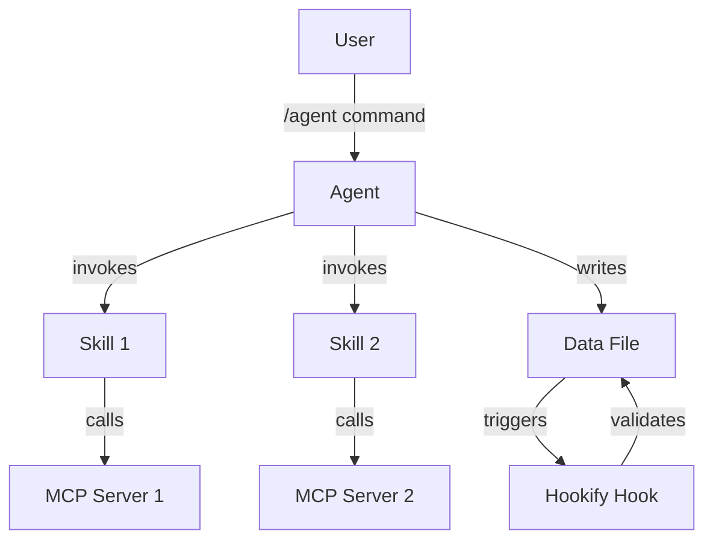

# C5: Complete Automation Workflows Reference

## Overview

This document provides complete technical details on all Claude Code automation tools used in this project.

**Quick Links**:
- [Agents](#agents)
- [Skills](#skills)
- [Hookify Hooks](#hooks)
- [MCP Servers](#mcp-servers)

---

## Agents

### b-school-page-creator

**Purpose**: Creates comprehensive, authoritative landing pages for business schools and educational institutes

**File**: `.claude/agents/b-school-page-creator.md`

**Skills Used**: None explicitly defined (self-contained agent)

**MCPs Used**:
- Parallel-search-mcp (web research for official statistics, rankings)
- reddit-mcp-buddy (student experiences, candid reviews)
- plugin:serena (code navigation and TypeScript management)

**Usage**:
```bash
/agent b-school-page-creator
```

**Output**: Creates comprehensive school profile in `app/data/iim-schools-v2.ts` (or modular school files)

**Model**: Claude Opus (complex research + writing task)

---

### engineering-content-pipeline

**Purpose**: End-to-end content creation agent for engineering career articles. Supports Company Interview Guides and Technical Topic Guides.

**File**: `.claude/agents/engineering-content-pipeline.md`

**Skills Used**:
- engineering-market-intelligence
- engineering-deep-research
- engineering-topic-ideation
- engineering-topic-guide
- engineering-article-writer
- engineering-seo-optimizer
- engineering-seo-implementation
- engineering-ts-formatter

**MCPs Used**:
- reddit-mcp-buddy (r/cscareerquestions, r/leetcode)
- Parallel-search-mcp (company data, salary info)
- lighthouse (SEO validation)
- plugin:serena (code management)

**Usage**:
```bash
/agent engineering-content-pipeline
```

**Output**: Creates content in `app/data/engineering-content.ts` or `app/data/technical-interview-questions.ts`

**Model**: Claude Opus (7-phase pipeline)

---

### c5-documentation-generator

**Purpose**: Generates C5 (Claude Code Usage) documentation for ANY codebase, showing which agents/skills/MCPs were used to create which content

**File**: `.claude/agents/c5-documentation-generator.md`

**Skills Used**:
- c5-discover-automation (Phase 1: Discovery)
- c5-analyze-git-history (Phase 2: Git Analysis)
- c5-analyze-content (Phase 3: Content Mapping)
- c5-generate-docs (Phase 4: Doc Generation)

**MCPs Used**:
- plugin:serena (code navigation)

**Usage**:
```bash
/agent c5-documentation-generator
```

**Output**: Creates 5-7 C5 markdown files in `docs/architecture/`

**Model**: Claude Opus (complex multi-phase analysis)

**Note**: Universal tool that works on ANY codebase with `.claude/` directory

---

## Skills

### engineering-market-intelligence

**Purpose**: Analyzes job market demand, identifies trending companies and technical topics

**File**: `.claude/skills/engineering-market-intelligence.md`

**Used By**: engineering-content-pipeline

**Usage**:
```bash
/skill engineering-market-intelligence
```

---

### engineering-deep-research

**Purpose**: Gathers interview questions, hiring patterns, preparation resources from Reddit and web sources

**File**: `.claude/skills/engineering-deep-research.md`

**Used By**: engineering-content-pipeline

**MCPs Used**: reddit-mcp-buddy, Parallel-search-mcp

---

### engineering-topic-ideation

**Purpose**: Generates content angles, subtopics, and article structure for engineering topics

**File**: `.claude/skills/engineering-topic-ideation.md`

**Used By**: engineering-content-pipeline

---

### engineering-topic-guide

**Purpose**: Creates technical topic guides (DSA, CN, DBMS, OS) with conceptual explanations

**File**: `.claude/skills/engineering-topic-guide.md`

**Used By**: engineering-content-pipeline

---

### engineering-article-writer

**Purpose**: Writes publication-ready articles with research citations and real examples

**File**: `.claude/skills/engineering-article-writer.md`

**Used By**: engineering-content-pipeline

---

### engineering-seo-optimizer

**Purpose**: Creates SEO-optimized titles, meta descriptions, keywords targeting interview prep queries

**File**: `.claude/skills/engineering-seo-optimizer.md`

**Used By**: engineering-content-pipeline

---

### engineering-seo-implementation

**Purpose**: Implements structured data (JobPosting, Article, FAQ, Breadcrumb schemas), meta tags, internal linking

**File**: `.claude/skills/engineering-seo-implementation.md`

**Used By**: engineering-content-pipeline

---

### engineering-ts-formatter

**Purpose**: Formats content into TypeScript data structure for data files

**File**: `.claude/skills/engineering-ts-formatter.md`

**Used By**: engineering-content-pipeline

---

### c5-discover-automation

**Purpose**: Phase 1 of C5 generation - discovers automation setup in codebase

**File**: `.claude/skills/c5-discover-automation.md`

**Used By**: c5-documentation-generator

---

### c5-analyze-git-history

**Purpose**: Phase 2 of C5 generation - analyzes git commits to find automation usage

**File**: `.claude/skills/c5-analyze-git-history.md`

**Used By**: c5-documentation-generator

---

### c5-analyze-content

**Purpose**: Phase 3 of C5 generation - maps content to agents/skills/MCPs used

**File**: `.claude/skills/c5-analyze-content.md`

**Used By**: c5-documentation-generator

---

### c5-generate-docs

**Purpose**: Phase 4 of C5 generation - generates C5 markdown files from templates

**File**: `.claude/skills/c5-generate-docs.md`

**Used By**: c5-documentation-generator

---

## Hooks

### seo-audit-reminder

**Trigger**: Content changes in blog posts, school pages, or other SEO-critical files

**Action**: Reminds developer to run SEO audits after content modifications

**File**: `.claude/hookify.seo-audit-reminder.local.md`

**Purpose**: Ensures SEO quality is validated before committing content changes

---

### git-pull-reminder

**Trigger**: File changes to `app/data/` directory

**Action**: Reminds developer to pull latest changes before editing content files

**File**: `.claude/hookify.git-pull-reminder.local.md`

**Purpose**: Prevents merge conflicts when multiple developers edit content simultaneously

---

## MCP Servers

### reddit-mcp-buddy

**Operations**:
- `browse_subreddit`: Browse posts from specific subreddits
- `search_reddit`: Search for posts matching query
- `get_post_details`: Get full post with comments
- `user_analysis`: Analyze Reddit user's posting history

**Used By**: b-school-page-creator, engineering-content-pipeline (engineering-deep-research skill)

**Configuration**:
```json
{
  "reddit-mcp-buddy": {
    "command": "npx",
    "args": ["-y", "reddit-mcp-buddy"],
    "env": {}
  }
}
```

**Subreddits Used**:
- r/CAT_Preparation (MBA/B-school content)
- r/MBA (MBA admissions, rankings)
- r/cscareerquestions (engineering interviews)
- r/leetcode (technical questions)
- r/developersIndia (India-focused tech careers)

---

### Parallel-search-mcp

**Operations**:
- `web_search_preview`: Perform web searches with LLM-friendly results
- `web_fetch`: Fetch and extract content from URLs

**Used By**: b-school-page-creator, engineering-content-pipeline

**Configuration**:
```json
{
  "Parallel-search-mcp": {
    "command": "uvx",
    "args": ["parallel-search-mcp"]
  }
}
```

**Use Cases**:
- Official school/company statistics
- Ranking sources (US News, Financial Times, NIRF)
- Employment and salary data
- Company hiring pages

---

### lighthouse

**Operations**:
- `run_audit`: Run comprehensive Lighthouse audit
- `get_seo_analysis`: Get SEO score and recommendations
- `get_performance_score`: Get performance metrics
- `get_core_web_vitals`: Get Core Web Vitals

**Used By**: engineering-content-pipeline (engineering-seo-implementation skill)

**Configuration**:
```json
{
  "lighthouse": {
    "command": "npx",
    "args": ["-y", "@modelcontextprotocol/server-lighthouse"]
  }
}
```

**Threshold**: 90+ SEO score required for published content

---

### plugin:serena

**Operations**:
- `read_file`: Read TypeScript/JavaScript files
- `list_dir`: List directory contents
- `find_file`: Find files by pattern
- `get_symbols_overview`: Get code symbol overview
- `find_symbol`: Find specific code symbols
- `create_text_file`: Write new files
- `replace_content`: Edit existing files

**Used By**: All agents (for code navigation and file management)

**Configuration**:
```json
{
  "plugin:serena": {
    "command": "uvx",
    "args": ["serena-mcp-plugin"]
  }
}
```

**Use Cases**:
- TypeScript data file management
- Code structure navigation
- File creation and editing

---

## Workflow Diagrams

### Agent Orchestration Flow



### Content Creation Pipeline (engineering-content-pipeline)


---

## Configuration Files

### Agent Files Location
```
.claude/agents/
├── b-school-page-creator.md
├── engineering-content-pipeline.md
└── c5-documentation-generator.md
```

### Skill Files Location
```
.claude/skills/
├── engineering-article-writer.md
├── engineering-deep-research.md
├── engineering-market-intelligence.md
├── engineering-seo-implementation.md
├── engineering-seo-optimizer.md
├── engineering-topic-guide.md
├── engineering-topic-ideation.md
├── engineering-ts-formatter.md
├── c5-discover-automation.md
├── c5-analyze-git-history.md
├── c5-analyze-content.md
└── c5-generate-docs.md
```

### Hook Files Location
```
.claude/
├── hookify.seo-audit-reminder.local.md
└── hookify.git-pull-reminder.local.md
```

### MCP Configuration
```json
// .claude/settings.local.json
{
  "mcpServers": {
    "reddit-mcp-buddy": {
      "command": "npx",
      "args": ["-y", "reddit-mcp-buddy"]
    },
    "Parallel-search-mcp": {
      "command": "uvx",
      "args": ["parallel-search-mcp"]
    },
    "lighthouse": {
      "command": "npx",
      "args": ["-y", "@modelcontextprotocol/server-lighthouse"]
    },
    "plugin:serena": {
      "command": "uvx",
      "args": ["serena-mcp-plugin"]
    }
  }
}
```

---

## Usage Patterns

### Pattern 1: Single-Agent Content Generation

```bash
# 1. Run agent
/agent b-school-page-creator

# 2. Agent automatically:
#    - Invokes MCPs for research
#    - Generates comprehensive content
#    - Writes to data file

# 3. Review and commit
git add app/data/iim-schools-v2.ts
git commit -m "feat: Add [School Name] interview guide"
```

### Pattern 2: Multi-Skill Pipeline

```bash
# 1. Run agent that orchestrates multiple skills
/agent engineering-content-pipeline

# 2. Agent runs 7-phase pipeline:
#    - Market Intelligence → Deep Research → Topic Ideation
#    → Article Writing → SEO Optimization → SEO Implementation
#    → TS Formatting

# 3. Review output and commit
```

### Pattern 3: Hook-Triggered Validation

```bash
# 1. Modify data file
# 2. Hook automatically triggers
# 3. Validation runs (git pull check, SEO audit, etc.)
# 4. Warnings displayed if issues found
```

---

## Best Practices

### Agent Development

1. **Keep agents focused** - One agent per content type (B-schools, engineering, etc.)
2. **Use skills for reusability** - Don't duplicate logic across agents
3. **Document workflows clearly** - Update agent files with step-by-step process
4. **Test thoroughly** - Validate output matches quality standards

### Skill Development

1. **Make skills atomic** - Each skill does one thing well (research, writing, SEO, formatting)
2. **Accept parameters** - Make skills configurable for different use cases
3. **Return structured data** - Use consistent JSON output formats
4. **Handle errors gracefully** - Return warnings instead of failing silently

### MCP Integration

1. **Cache responses** - Avoid redundant API calls to same endpoints
2. **Rate limit awareness** - Respect API limits (Reddit API, web search)
3. **Fallback strategies** - Have backup data sources if primary fails
4. **Error handling** - MCPs may be unavailable, handle gracefully

### Hook Configuration

1. **Keep hooks lightweight** - Fast execution (<1 second)
2. **Non-blocking warnings** - Don't prevent commits, just warn
3. **Clear messaging** - Actionable warnings ("Pull before editing")
4. **Scoped triggers** - Only trigger for relevant file changes

---

## Extending the System

### Adding a New Agent

1. Create `.claude/agents/your-agent.md`
2. Define purpose, workflow, skills/MCPs used
3. Test with `/agent your-agent`
4. Update C5 docs with `/agent c5-documentation-generator`

### Adding a New Skill

1. Create `.claude/skills/your-skill.md`
2. Define inputs, outputs, implementation
3. Invoke from agent or use standalone: `/skill your-skill`
4. Update C5 docs

### Adding a New MCP Server

1. Add to `.claude/settings.local.json`
2. Restart Claude Code
3. Invoke from skills or agents
4. Update C5 docs

### Adding a New Hook

1. Create `.claude/hookify.your-hook.local.md`
2. Define trigger condition and action
3. Test by modifying relevant files
4. Update C5 docs

---

## Troubleshooting

### Agent Not Responding

**Problem**: Agent command doesn't execute
**Solution**:
- Check agent file exists in `.claude/agents/`
- Verify agent name matches filename (without `.md`)
- Restart Claude Code

### MCP Server Connection Failed

**Problem**: "MCP server not available" error
**Solution**:
- Check `.claude/settings.local.json` configuration
- Verify MCP package is installed (`npx -y [package]` or `uvx [package]`)
- Restart Claude Code to reload MCP servers

### Skill Not Found

**Problem**: Agent can't invoke skill
**Solution**:
- Check skill file exists in `.claude/skills/`
- Verify skill name is correct in agent invocation
- Check skill is not disabled in settings

### Hook Not Triggering

**Problem**: Expected hook doesn't run on file change
**Solution**:
- Check hook file exists in `.claude/`
- Verify hook trigger pattern matches file being edited
- Check hook is not disabled in settings

### Content Quality Issues

**Problem**: Generated content doesn't meet standards
**Solution**:
- Review research sources (Reddit, web search results)
- Manually edit generated content
- Provide more specific prompts to agent
- Update agent/skill instructions

---

**[← Back to C5 Overview](c5-README.md)**

---

**Last Updated**: January 13, 2026
**Generated by**: C5 Documentation Generator
